# Teams SDK - TypeScript Documentation (Complete)

> Microsoft Teams SDK - A comprehensive framework for building AI-powered Teams applications using TypeScript. Using this SDK, you can easily build and integrate a variety of features in Microsoft Teams by building Agents or Tools. The documentation here helps by giving background information and code samples on how best to do this.

IMPORTANT THINGS TO REMEMBER:
- This SDK is NOT based off of BotFramework (which the _previous_ version of the Teams SDK was based on). This SDK is a completely new framework. Use this guide to find snippets to drive your decisions.
- When scaffolding new applications, using the CLI is a lot simpler and preferred than doing it all by yourself. See the Quickstart guide for that.
- It's a good idea to build the application using `npm run build` and fix compile time errors to help ensure the app works as expected.
- The SDK uses typescript to help you make the right decisions when using the APIs. You may check type definitions and type checkers to make sure your code is correct.

YOU MUST FOLLOW THE ABOVE GUIDANCE.

## Main Documentation

### A2A Server

# A2A Server

## What is an A2A Server?

An A2A server is an agent that exposes its capabilities to other agents using the A2A protocol. With this package, you can make your Teams app accessible to A2A clients.

## Adding the `A2APlugin`

To enable A2A server functionality, add the `A2APlugin` to your Teams app and provide an `agentCard`:

```typescript

const agentCard: AgentCard = {
  name: 'Weather Agent',
  description: 'An agent that can tell you the weather',
  url: `http://localhost:${PORT}/a2a`,
  version: '0.0.1',
  protocolVersion: '0.3.0',
  capabilities: {},
  defaultInputModes: [],
  defaultOutputModes: [],
  skills: [
    {
      id: 'get_weather',
      name: 'Get Weather',
      description: 'Get the weather for a given location',
      tags: ['weather', 'get', 'location'],
      examples: [
        'Get the weather for London',
        'What is the weather',
        "What's the weather in Tokyo?",
        'How is the current temperature in San Francisco?',
      ],
    },
  ],
};

const app = new App({
  plugins: [
    new A2APlugin({
      agentCard,
    }),
  ],
});
```

## Agent Card Exposure

The plugin automatically exposes your agent card at the path `/a2a/.well-known/agent-card.json`.

## Handling A2A Requests

Handle incoming A2A requests by adding an event handler for the `a2a:message` event. You may use `accumulateArtifacts` to iteratively accumulate artifacts for the task, or simply `respond` with the final result.

```typescript
app.event('a2a:message', async ({ respond, requestContext }) => {
  logger.info(`Received message: ${requestContext.userMessage}`);
  const textInput = requestContext.userMessage.parts
    .filter((p): p is TextPart => p.kind === 'text')
    .at(0)?.text;
  if (!textInput) {
    await respond('My agent currently only supports text input');
    return;
  }
  const result = await myEventHandler(textInput);
  await respond(result);
});
```

:::note

- You must have only a single handler that calls `respond`.
- You **must** call `respond` as the last step in your handler. This resolves the open request to the caller.

:::

## Sequence Diagram

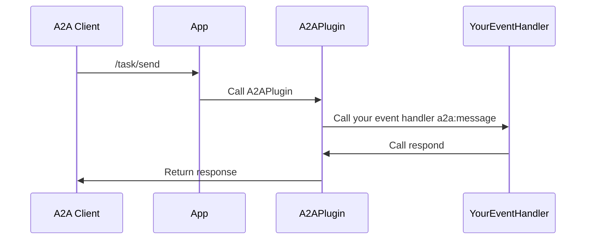

---

### Action commands

# Action commands

Action commands allow you to present your users with a modal pop-up called a dialog in Teams. The dialog collects or displays information, processes the interaction, and sends the information back to Teams compose box.

## Action command invocation locations

There are three different areas action commands can be invoked from:

1. Compose Area
2. Compose Box
3. Message

### Compose Area and Box


### Message action command


:::tip
See the [Invoke Locations](https://learn.microsoft.com/en-us/microsoftteams/platform/messaging-extensions/how-to/action-commands/define-action-command?tabs=Teams-toolkit%2Cdotnet#select-action-command-invoke-locations) guide to learn more about the different entry points for action commands.
:::

## Setting up your Teams app manifest

To use action commands you have define them in the Teams app manifest. Here is an example:

```json
"composeExtensions": [
    {
        "botId": "${{BOT_ID}}",
        "commands": [
            {
            "id": "createCard",
            "type": "action",
            "context": [
                "compose",
                "commandBox"
            ],
            "description": "Command to run action to create a card from the compose box.",
            "title": "Create Card",
            "parameters": [
                {
                    "name": "title",
                    "title": "Card title",
                    "description": "Title for the card",
                    "inputType": "text"
                },
                {
                    "name": "subTitle",
                    "title": "Subtitle",
                    "description": "Subtitle for the card",
                    "inputType": "text"
                },
                {
                    "name": "text",
                    "title": "Text",
                    "description": "Text for the card",
                    "inputType": "textarea"
                }
            ]
            },
            {
                "id": "getMessageDetails",
                "type": "action",
                "context": [
                    "message"
                ],
                "description": "Command to run action on message context.",
                "title": "Get Message Details"
            },
            {
                "id": "fetchConversationMembers",
                "description": "Fetch the conversation members",
                "title": "Fetch Conversation Members",
                "type": "action",
                "fetchTask": true,
                "context": [
                    "compose"
                ]
            },
        ]
    }
]
```

Here we have defining three different commands:

1. `createCard` - that can be invoked from either the `compose` or `commandBox` areas. Upon invocation a dialog will popup asking the user to fill the `title`, `subTitle`, and `text`.


2. `getMessageDetails` - It is invoked from the `message` overflow menu. Upon invocation the message payload will be sent to the app which will then return the details like `createdDate`, etc.


3. `fetchConversationMembers` - It is invoked from the `compose` area. Upon invocation the app will return an adaptive card in the form of a dialog with the conversation roster.


## Handle submission

Handle submission when the `createCard` or `getMessageDetails` action commands are invoked.

```typescript

// ...

app.on('message.ext.submit', async ({ activity }) => {
  const { commandId } = activity.value;
  let card: IAdaptiveCard;

  if (commandId === 'createCard') {
    // The activity.value.commandContext == "compose" here because it was from
    // the compose box
    card = createCard(activity.value.data);
  } else if (commandId === 'getMessageDetails' && activity.value.messagePayload) {
    // The activity.value.commandContext == "message" here because it was from
    // the message context
    card = createMessageDetailsCard(activity.value.messagePayload);
  } else {
    throw new Error(`Unknown commandId: ${commandId}`);
  }

  return {
    composeExtension: {
      type: 'result',
      attachmentLayout: 'list',
      attachments: [cardAttachment('adaptive', card)],
    },
  };
});
```

### Create card

`createCard()` function

```typescript

// ...

interface IFormData {
  title: string;
  subtitle: string;
  text: string;
}

export function createCard(data: IFormData) {
  return new AdaptiveCard(
    new Image(IMAGE_URL),
    new TextBlock(data.title, {
      size: 'Large',
      weight: 'Bolder',
      color: 'Accent',
      style: 'heading',
    }),
    new TextBlock(data.subtitle, {
      size: 'Small',
      weight: 'Lighter',
      color: 'Good',
    }),
    new TextBlock(data.text, {
      wrap: true,
      spacing: 'Medium',
    })
  );
}
```

### Create message details card

`createMessageDetailsCard()` function

```typescript

  AdaptiveCard,
  CardElement,
  TextBlock,
  ActionSet,
  OpenUrlAction,
} from '@microsoft/teams.cards';
// ...

export function createMessageDetailsCard(messagePayload: Message) {
  const cardElements: CardElement[] = [
    new TextBlock('Message Details', {
      size: 'Large',
      weight: 'Bolder',
      color: 'Accent',
      style: 'heading',
    }),
  ];

  if (messagePayload?.body?.content) {
    cardElements.push(
      new TextBlock('Content', {
        size: 'Medium',
        weight: 'Bolder',
        spacing: 'Medium',
      }),
      new TextBlock(messagePayload.body.content)
    );
  }

  if (messagePayload?.attachments?.length) {
    cardElements.push(
      new TextBlock('Attachments', {
        size: 'Medium',
        weight: 'Bolder',
        spacing: 'Medium',
      }),
      new TextBlock(`Number of attachments: ${messagePayload.attachments.length}`, {
        wrap: true,
        spacing: 'Small',
      })
    );
  }

  if (messagePayload?.createdDateTime) {
    cardElements.push(
      new TextBlock('Created Date', {
        size: 'Medium',
        weight: 'Bolder',
        spacing: 'Medium',
      }),
      new TextBlock(messagePayload.createdDateTime, {
        wrap: true,
        spacing: 'Small',
      })
    );
  }

  if (messagePayload?.linkToMessage) {
    cardElements.push(
      new TextBlock('Message Link', {
        size: 'Medium',
        weight: 'Bolder',
        spacing: 'Medium',
      }),
      new ActionSet(
        new OpenUrlAction(messagePayload.linkToMessage, {
          title: 'Go to message',
        })
      )
    );
  }

  return new AdaptiveCard(...cardElements);
}
```

## Handle opening adaptive card dialog

Handle opening adaptive card dialog when the `fetchConversationMembers` command is invoked.

```typescript

// ...

app.on('message.ext.open', async ({ activity, api }) => {
  const conversationId = activity.conversation.id;
  const members = await api.conversations.members(conversationId).get();
  const card = createConversationMembersCard(members);

  return {
    task: {
      type: 'continue',
      value: {
        title: 'Conversation members',
        height: 'small',
        width: 'small',
        card: cardAttachment('adaptive', card),
      },
    },
  };
});
```

### Create conversation members card

`createConversationMembersCard()` function

```typescript

// ...

export function createConversationMembersCard(members: Account[]) {
  const membersList = members.map((member) => member.name).join(', ');

  return new AdaptiveCard(
    new TextBlock('Conversation members', {
      size: 'Medium',
      weight: 'Bolder',
      color: 'Accent',
      style: 'heading',
    }),
    new TextBlock(membersList, {
      wrap: true,
      spacing: 'Small',
    })
  );
}
```

## Resources

- [Action commands](https://learn.microsoft.com/en-us/microsoftteams/platform/messaging-extensions/how-to/action-commands/define-action-command?tabs=Teams-toolkit%2Cdotnet)
- [Returning Adaptive Card Previews in Task Modules](https://learn.microsoft.com/en-us/microsoftteams/platform/messaging-extensions/how-to/action-commands/respond-to-task-module-submit?tabs=dotnet%2Cdotnet-1#bot-response-with-adaptive-card)

---

### Adaptive Cards

# Adaptive Cards

Overview of Adaptive Cards in TypeScript Teams SDK for building rich, interactive user experiences in Teams applications.

Adaptive Cards provide a flexible, cross-platform content format for creating rich, interactive experiences. They consist of a customizable body of card elements combined with optional action sets, all fully serializable for delivery to clients. Through a powerful combination of text, graphics, and interactive buttons, Adaptive Cards enable compelling user experiences across various platforms.

The Adaptive Card framework is widely implemented throughout Microsoft's ecosystem, with significant integration in Microsoft Teams. Within Teams, Adaptive Cards power numerous key scenarios including:

- Rich interactive messages
- Dialogs
- Message Extensions
- Link Unfurling
- Configuration forms
- And many more application contexts

Mastering Adaptive Cards is essential for creating sophisticated, engaging experiences that leverage the full capabilities of the Teams platform. This guide will help you learn how to use them in this SDK.

For a more comprehensive guide on Adaptive Cards, see the [official documentation](https://adaptivecards.microsoft.com/).

---

### App Basics

# App Basics

The `App` class is the main entry point for your agent.

It is responsible for:

1. Hosting and running the server (via plugins)
2. Serving incoming requests and routing them to your handlers
3. Handling authentication for your agent to the Teams backend
4. Providing helpful utilities which simplify the ability for your application to interact with the Teams platform
5. Managing plugins which can extend the functionality of your agent

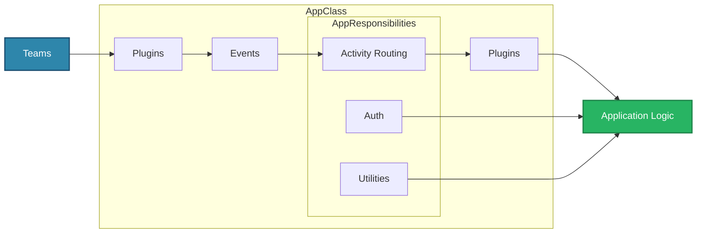

## Core Components

**Plugins**

- Can be used to set up the server
- Can listen to messages or send messages out

**Events**

- Listens to events from core plugins
- Emit interesting events to the application

**Activity Routing**

- Routes activities to appropriate handlers

**Utilities**

- Provides utility functions for convenience (like sending replies or proactive messages)

**Auth**

- Handles authenticating your agent with Teams, Graph, etc.
- Simplifies the process of authenticating your app or user for your app

**Plugins (Secondary)**

- Can hook into activity handlers or proactive scenarios
- Can modify or update agent activity events

## Plugins

You'll notice that plugins are present in the front, which exposes your application as a server, and also in the back after the app does some processing to the incoming message. The plugin architecture allows the application to be built in an extremely modular way. Each plugin can be swapped out to change or augment the functionality of the application. The plugins can listen to various events that happen (e.g. the server starting or ending, an error occuring, etc), activities being sent to or from the application and more. This allows the application to be extremely flexible and extensible.

---

### Building Adaptive Cards

# Building Adaptive Cards

Adaptive Cards are JSON payloads that describe rich, interactive UI fragments.

With `@microsoft/teams.cards` you can build these cards entirely in TypeScript/JavaScript while enjoying full IntelliSense and compiler safety.

## The Builder Pattern

`@microsoft/teams.cards` exposes small **builder helpers** including `Card`, `TextBlock`, `ToggleInput`, `ExecuteAction`, _etc._

Each helper wraps raw JSON and provides fluent, chainable methods that keep your code concise and readable.

```ts

  AdaptiveCard,
  TextBlock,
  ToggleInput,
  ExecuteAction,
  ActionSet,
} from '@microsoft/teams.cards';

const card = new AdaptiveCard(
  new TextBlock('Hello world', { wrap: true, weight: 'Bolder' }),
  new ToggleInput('Notify me').withId('notify'),
  new ActionSet(
    new ExecuteAction({ title: 'Submit' })
      .withData({ action: 'submit_basic' })
      .withAssociatedInputs('auto')
  )
);
```

Benefits:

| Benefit     | Description                                                                   |
| ----------- | ----------------------------------------------------------------------------- |
| Readability | No deep JSON trees—just chain simple methods.                                 |
| Re‑use      | Extract snippets to functions or classes and share across cards.              |
| Safety      | Builders validate every property against the Adaptive Card schema (see next). |

:::info
Source code lives in `teams.ts/packages/cards/src/`. Feel free to inspect or extend the helpers for your own needs.
:::

## Type‑safe Authoring & IntelliSense

The package bundles the **Adaptive Card v1.5 schema** as strict TypeScript/JavaScript types.
While coding you get:

- **Autocomplete** for every element and attribute.
- **In‑editor validation**—invalid enum values or missing required properties produce build errors.
- Automatic upgrades when the schema evolves; simply update the package.

```typescript
// @ts-expect-error: "huge" is not a valid size for TextBlock
const textBlock = new TextBlock('Valid', { size: 'huge' });
```

## The Visual Designer

Prefer a drag‑and‑drop approach? Use [Microsoft's Adaptive Card Designer](https://adaptivecards.microsoft.com/designer.html):

1. Add elements visually until the card looks right.
2. Copy the JSON payload from the editor pane.
3. Paste the JSON into your project **or** convert it to builder calls:

```typescript
const cardJson = /* copied JSON */;
const card = new AdaptiveCard().withBody(cardJson);
```

```ts
const rawCard: IAdaptiveCard = {
  type: 'AdaptiveCard',
  body: [
    {
      text: 'Please fill out the below form to send a game purchase request.',
      wrap: true,
      type: 'TextBlock',
      style: 'heading',
    },
    {
      columns: [
        {
          width: 'stretch',
          items: [
            {
              choices: [
                { title: 'Call of Duty', value: 'call_of_duty' },
                { title: "Death's Door", value: 'deaths_door' },
                { title: 'Grand Theft Auto V', value: 'grand_theft' },
                { title: 'Minecraft', value: 'minecraft' },
              ],
              style: 'filtered',
              placeholder: 'Search for a game',
              id: 'choiceGameSingle',
              type: 'Input.ChoiceSet',
              label: 'Game:',
            },
          ],
          type: 'Column',
        },
      ],
      type: 'ColumnSet',
    },
  ],
  actions: [
    {
      title: 'Request purchase',
      type: 'Action.Execute',
      data: { action: 'purchase_item' },
    },
  ],
  version: '1.5',
};
```

This method leverages the full Adaptive Card schema and ensures that the payload adheres strictly to `IAdaptiveCard`.

:::tip
You can use a combination of raw JSON and builder helpers depending on whatever you find easier.
:::

## End‑to‑end Example – Task Form Card

Below is a complete example showing a task management form.

Notice how the builder pattern keeps the file readable and maintainable:

```ts

  AdaptiveCard,
  TextBlock,
  TextInput,
  ChoiceSetInput,
  DateInput,
  ActionSet,
  ExecuteAction,
} from '@microsoft/teams.cards';

// ...

app.on('message', async ({ send, activity }) => {
  await send({ type: 'typing' });
  const card = new AdaptiveCard(
    new TextBlock('Create New Task', {
      size: 'Large',
      weight: 'Bolder',
    }),
    new TextInput({ id: 'title' }).withLabel('Task Title').withPlaceholder('Enter task title'),
    new TextInput({ id: 'description' })
      .withLabel('Description')
      .withPlaceholder('Enter task details')
      .withIsMultiline(true),
    new ChoiceSetInput(
      { title: 'High', value: 'high' },
      { title: 'Medium', value: 'medium' },
      { title: 'Low', value: 'low' }
    )
      .withId('priority')
      .withLabel('Priority')
      .withValue('medium'),
    new DateInput({ id: 'due_date' })
      .withLabel('Due Date')
      .withValue(new Date().toISOString().split('T')[0]),
    new ActionSet(
      new ExecuteAction({ title: 'Create Task' })
        .withData({ action: 'create_task' })
        .withAssociatedInputs('auto')
        .withStyle('positive')
    )
  );
  await send(card);
  // Or build a complex activity out that includes the card:
  // const message  = new MessageActivity('Enter this form').addCard('adaptive', card);
  // await send(message);
});
```

## Additional Resources

- [**Official Adaptive Card Documentation**](https://adaptivecards.microsoft.com/)
- [**Adaptive Cards Designer**](https://adaptivecards.microsoft.com/designer.html)

### Summary

- Use **builder helpers** for readable, maintainable card code.
- Enjoy **full type safety** and IDE assistance.
- Prototype quickly in the **visual designer** and refine with builders.

Happy card building! 🎉

---

### Creating Dialogs

# Creating Dialogs

:::tip
If you're not familiar with how to build Adaptive Cards, check out [the cards guide](../adaptive-cards). Understanding their basics is a prerequisite for this guide.
:::

## Entry Point

To open a dialog, add a button to your Adaptive Card using `OpenDialogData`. This sets up the `task/fetch` protocol and includes a `dialog_id` that the SDK uses to route to the correct handler.

```typescript

  AdaptiveCard,
  IAdaptiveCard,
  OpenDialogData,
  SubmitAction,
} from '@microsoft/teams.cards';
// ...

app.on('message', async ({ send }) => {
  await send({ type: 'typing' });

  const card: IAdaptiveCard = new AdaptiveCard({
    type: 'TextBlock',
    text: 'Select the examples you want to see!',
    size: 'Large',
    weight: 'Bolder',
  }).withActions(
    // OpenDialogData sets msteams.type = "task/fetch" and adds dialog_id for routing
    new SubmitAction()
      .withTitle('Simple form test')
      .withData(new OpenDialogData('simple_form')),
    new SubmitAction()
      .withTitle('Webpage Dialog')
      .withData(new OpenDialogData('webpage_dialog')),
    new SubmitAction()
      .withTitle('Multi-step Form')
      .withData(new OpenDialogData('multi_step_form'))
  );

  await send(new MessageActivity('Enter this form').addCard('adaptive', card));
});
```

## Handling Dialog Open Events

When a user clicks the button, Teams sends a `task/fetch` invoke to your app. Register a handler using `dialog.open.<dialog_id>` to handle a specific dialog, or `dialog.open` for a catch-all.

:::tip
Use sub-routes like `dialog.open.simple_form` to handle specific dialogs directly, instead of a single catch-all handler with if-else logic. This keeps each handler focused and avoids routing boilerplate.
:::

```typescript

// ...

// Handle a specific dialog by ID — no if-else needed
app.on('dialog.open.simple_form', async ({ activity }) => {
  const card: IAdaptiveCard = new AdaptiveCard()...

  return {
    task: {
      type: 'continue',
      value: {
        title: 'Title of Dialog',
        card: cardAttachment('adaptive', card),
      },
    },
  };
});
```

### Rendering A Card

You can render an Adaptive Card in a dialog by returning a card response.

```typescript

// ...

app.on('dialog.open.simple_form', async () => {
  const dialogCard = new AdaptiveCard(
    {
      type: 'TextBlock',
      text: 'This is a simple form',
      size: 'Large',
      weight: 'Bolder',
    },
    new TextInput()
      .withLabel('Name')
      .withIsRequired()
      .withId('name')
      .withPlaceholder('Enter your name')
  )
    // Use SubmitData to set the "action" field, which routes to dialog.submit.<action>
    .withActions(
      new SubmitAction().withTitle('Submit').withData(new SubmitData('simple_form'))
    );

  return {
    task: {
      type: 'continue',
      value: {
        title: 'Simple Form Dialog',
        card: cardAttachment('adaptive', dialogCard),
      },
    },
  };
});
```

:::info
The action type for submitting a dialog must be `Action.Submit`. This is a requirement of the Teams client. If you use a different action type, the dialog will not be submitted and the agent will not receive the submission event.
:::

### Rendering A Webpage

You can render a webpage in a dialog as well. There are some security requirements to be aware of:

1. The webpage must be hosted on a domain that is allow-listed as `validDomains` in the Teams app [manifest](/teams/manifest) for the agent
2. The webpage must also host the [teams-js client library](https://www.npmjs.com/package/@microsoft/teams-js). The reason for this is that for security purposes, the Teams client will not render arbitrary webpages. As such, the webpage must explicitly opt-in to being rendered in the Teams client. Setting up the teams-js client library handles this for you.

```typescript

// ...

app.on('dialog.open.webpage_dialog', async () => {
  return {
    task: {
      type: 'continue',
      value: {
        title: 'Webpage Dialog',
        // The webpage must be publicly accessible, use the teams-js client library,
        // and be registered in validDomains in the manifest.
        url: `${process.env['BOT_ENDPOINT']}/tabs/dialog-form`,
        width: 1000,
        height: 800,
      },
    },
  };
});
```

### Setting up Embedded Web Content

To serve web content for dialogs, you can use the `tab` method to host static webpages:

```typescript

// In your app setup (e.g., index.ts)
// Hosts a static webpage at /tabs/dialog-form
app.tab('dialog-form', path.join(__dirname, 'views', 'customform'));
```

---

### Executing Functions

# Executing Functions

The client App exposes an `exec()` method that can be used to call functions implemented in an agent created with this SDK. The function call uses the `app.http` client to make a request, attaching a bearer token created from the `app.msalInstance` MSAL public client application, so that the remote function can authenticate and authorize the caller.

The `exec()` method supports passing arguments and provides options to attach custom request headers and/or controlling the MSAL token scope.

## Invoking a remote function

When the tab app and the remote agent are deployed to the same location and in the same AAD app, it's simple to construct the client app and call the function.

```typescript

const app = new App(clientId);
await app.start();

// this requests a token for 'api://<clientId>/access_as_user' and attaches
// that to an HTTP POST request to /api/functions/my-function
const result = await app.exec<string>('my-function');
```

If the deployment is more complex, the [AppOptions](../app-options) can be used to influence the URL as well as the scope in the token.

## Function arguments

Any argument for the remote function can be provided as an object.

```typescript
const args = { arg1: 'value1', arg2: 'value2' };
const result = await app.exec('my-function', args);
```

## Request headers

By default, the HTTP request will include a header with a bearer token as well as headers that give contextual information about the state of the app, such as which channel or team or chat or meeting the tab is active in.

If needed, you can add additional headers to the `requestHeaders` option field. This may be handy to provide additional context to the remote function, such as a logging correlation ID.

```typescript
const requestHeaders = {
  'x-custom-correlation-id': 'aaaa0000-bb11-2222-33cc-444444dddddd',
};

// custom headers when the function does not take arguments
const result = await app.exec('my-function', undefined, { requestHeaders });

// custom headers when the function takes arguments
const args = { arg1: 'value1', arg2: 'value2' };
const result = await app.exec('my-other-function', args, { requestHeaders });
```

## Request bearer token

By default, the HTTP request will include a header with a bearer token acquired by requesting an `access_as_user` permission. The resource used for the request depends on the `remoteApiOptions.remoteAppResource` [AppOption](../app-options). If this app option is not provided, the token is requested for the scope `api://<clientId>/access_as_user`. If this option is provided, the token is requested for the scope `<remoteApiOptions.remoteAppResource>/access_as_user`.

When calling a function that requires a different permission or scope, the `exec` options let you override the behavior.

To specify a custom permission, set the permission field in the `exec` options.

```typescript
// with this option, the exec() call will request a token for either
// api://<clientId>/my_custom_permission or
// <remoteApiOptions.remoteAppResource>/my_custom_permission,
// depending on the app options used.
const options = {
  permission: 'my_custom_permission',
};

// custom permission when the function does not take arguments
const result = await app.exec('my-function', undefined, options);

// custom permission when the function takes arguments
const args = { arg1: 'value1', arg2: 'value2' };
const result = await app.exec('my-other-function', args, options);
```

Sometimes you may need even more control. You might for need a scope for a different resource than your default when calling a particular remote agent function. In these cases you can provide the exact token request object you need as part of the `exec` options.

```typescript
// with this option, the exec() call will request a token for exactly
// api://my-custom-resources/my_custom_scope, regardless of which app
// options were used to construct the app.
const options = {
  msalTokenRequest: {
    scopes: ['api://my-custom-resources/my_custom_scope'],
  },
};

// custom token request when the function does not take arguments
const result = await app.exec('my-function', undefined, options);

// custom token request when the function takes arguments
const args = { arg1: 'value1', arg2: 'value2' };
const result = await app.exec('my-other-function', args, options);
```

## Ensuring user consent

The `exec()` function supports incremental, just-in-time consent such that the user is prompted to consent during the `exec()` call, if they haven't already consented earlier.

If you find that you'd rather test for consent or request consent before making the `exec()` call, the `hasConsentForScopes` and `ensureConsentForScopes` can be used. More details about those are given in the [Graph](../graph) section.

## References

- [Graph API overview](https://learn.microsoft.com/en-us/graph/api/overview)
- [Graph API permissions overview](https://learn.microsoft.com/en-us/graph/permissions-reference)

---

### Getting started

# Getting started

To use this package, you can either set up a new project using the Teams CLI, or add it to an existing tab app project.

## Setting up a new project

The Teams CLI ships a `tab` template that scaffolds a new tab app with a callable remote function. First install the Teams CLI as outlined in the [Quickstart](../../getting-started/quickstart) guide, then create the app:

```sh
teams project new typescript my-first-tab-app --template tab
```

Once the project is created, follow [Quickstart: Register your app](/get-started/quickstart-register) to register and sideload it into Teams.

## Adding to an existing project

This package is set up to integrate well with existing Tab apps. The main consideration is that the AAD app must be configured to support Nested App Authentication (NAA). Otherwise it will not be possible to acquire the bearer token needed to call Microsoft Graph APIs or remote agent functions.

After verifying that the app is configured for NAA, simply use your package manager to add a dependency on `@microsoft/teams.client` and then proceed with [Starting the app](./using-the-app).

If you're already using a current version of TeamsJS, that's fine. This package works well with TeamsJS.

If you're already using Microsoft Authentication Library (MSAL) in an NAA enabled app, that's great! The [App options](./app-options) page shows how you can use a single common MSAL instance.

## Resources

- [Quickstart: Register your app](/get-started/quickstart-register)
- [Configuring an app for Nested App Authentication](https://learn.microsoft.com/en-us/microsoftteams/platform/concepts/authentication/nested-authentication#configure-naa)

---

### Listening To Activities

# Listening To Activities

An **Activity** is the Teams‑specific payload that flows between the user and your bot.
Where _events_ describe high‑level happenings inside your app, _activities_ are the raw Teams messages such as chat text, card actions, installs, or invoke calls.

The Teams SDK exposes a fluent router so you can subscribe to these activities with `app.on('<route>', …)`.

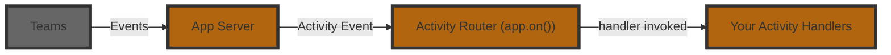

Here is an example of a basic message handler:

```typescript
app.on('message', async ({ activity, send }) => {
  await send(`You said: ${activity.text}`);
});
```

In the above example, the `activity` parameter is of type `MessageActivity`, which has a `text` property. You'll notice that the handler here does not return anything, but instead handles it by `send`ing a message back. For message activities, Teams does not expect your application to return anything (though it's usually a good idea to send some sort of friendly acknowledgment!).

[Other activity types](./activity-ref) have different properties and different required results. For a given handler, the SDK will automatically determine the type of `activity` and also enforce the correct return type.

## Middleware pattern

The `on` activity handlers follow a [middleware](https://www.patterns.dev/vanilla/mediator-pattern/) pattern similar to how `express` middlewares work. This means that for each activity handler, a `next` function is passed in which can be called to pass control to the next handler. This allows you to build a chain of handlers that can process the same activity in different ways.

```typescript
app.on('message', async ({ next }) => {
  console.log('global logger');
  next(); // pass control onward
});
```

```typescript
app.on('message', async ({ activity, next }) => {
  if (activity.text === '/help') {
    await send('Here are all the ways I can help you...');
    return;
  }

  // Conditionally pass control to the next handler
  next();
});
```

```typescript
app.on('message', async ({ activity }) => {
  // Fallthrough to the final handler
  await send(`Hello! you said ${activity.text}`);
});
```

:::info
Just like other middlewares, if you stop the chain by not calling `next()`, the activity will not be passed to the next handler. The order of registration for the handlers also matters as that determines how the handlers will be called.
:::

## Activity Reference

For a list of supported activities that your application can listen to, see the [activity reference](./activity-ref).

---

### MCP Server

# MCP Server

You are able to convert any `App` into an MCP server by using the `McpPlugin`. This plugin adds the necessary endpoints to your application to serve as an MCP server. The plugin allows you to define tools, resources, and prompts that can be exposed to other MCP applications.

Install it to your application:

```bash
npm install @microsoft/teams.mcp
```

Your plugin can be configured as follows:

```typescript

// ...

const mcpServerPlugin = new McpPlugin({
  // Describe the MCP server with a helpful name and description
  // for MCP clients to discover and use it.
  name: 'test-mcp',
  description: 'Allows you to test the mcp server',
  // Optionally, you can provide a URL to the mcp dev-tools
  // during development
  inspector: 'http://localhost:5173?proxyPort=9000',
}).tool(
  // Describe the tools with helpful names and descriptions
  'echo',
  'echos back whatever you said',
  {
    input: z.string().describe('the text to echo back'),
  },
  {
    readOnlyHint: true,
    idempotentHint: true,
  },
  async ({ input }) => {
    return {
      content: [
        {
          type: 'text',
          text: `you said "${input}"`,
        },
      ],
    };
  }
);
```

:::note
By default, the MCP server will be available at `/mcp` on your application. You can change this by setting the `transport.path` property in the plugin configuration.
:::

And included in the app like any other plugin:

```typescript

// ...

const app = new App({
  plugins: [
    new DevtoolsPlugin(),
    // Add this plugin
    mcpServerPlugin,
  ],
});
```

:::tip
Enabling mcp request inspection and the `DevtoolsPlugin` allows you to see all the requests and responses to and from your MCP server (similar to how the **Activities** tab works).
:::


## Piping messages to the user

Since your agent is provisioned to work on Teams, one very helpful feature is to use this server as a way to send messages to the user. This can be helpful in various scenarios:

1. Human in the loop - if the server or an MCP client needs to confirm something with the user, it is able to do so.
2. Notifications - the server can be used as a way to send notifications to the user.

Here is an example of how to do this. Configure your plugin so that:

1. It can validate if the incoming request is allowed to send messages to the user
2. It fetches the correct conversation ID for the given user.
3. It sends a proactive message to the user. See [Proactive Messaging](../../../essentials/sending-messages/proactive-messaging) for more details.

```typescript

// ...

// Keep a store of the user to the conversation id
// In a production app, you probably would want to use a
// persistent store like a database
const userToConversationId = new Map<string, string>();

// Add a an MCP server tool
mcpServerPlugin.tool(
  'alertUser',
  'alerts the user about something important',
  {
    input: z.string().describe('the text to echo back'),
    userAadObjectId: z.string().describe('the user to alert'),
  },
  {
    readOnlyHint: true,
    idempotentHint: true,
  },
  async ({ input, userAadObjectId }, { authInfo }) => {
    if (!isAuthValid(authInfo)) {
      throw new Error('Not allowed to call this tool');
    }

    const conversationId = userToConversationId.get(userAadObjectId);
    if (!conversationId) {
      console.log('Current conversation map', userToConversationId);
      return {
        content: [
          {
            type: 'text',
            text: `user ${userAadObjectId} is not in a conversation`,
          },
        ],
      };
    }

    // Leverage the app's proactive messaging capabilities to send a mesage to
    // correct conversation id.
    await app.send(conversationId, `Notification: ${input}`);
    return {
      content: [
        {
          type: 'text',
          text: 'User was notified',
        },
      ],
    };
  }
);
```

```typescript

// ...

app.on('message', async ({ send, activity }) => {
  await send({ type: 'typing' });
  await send(`you said "${activity.text}"`);
  if (activity.from.aadObjectId && !userToConversationId.has(activity.from.aadObjectId)) {
    userToConversationId.set(activity.from.aadObjectId, activity.conversation.id);
    app.log.info(
      `Just added user ${activity.from.aadObjectId} to conversation ${activity.conversation.id}`
    );
  }
});
```

---

### Middleware

# Middleware

Middleware is a useful tool for logging, validation, and more.
You can easily register your own middleware using the `app.use` method.

Below is an example of a middleware that will log the elapse time of all handlers that come after it.

```typescript
app.use(async ({ log, next }) => {
  const startedAt = new Date();
  await next();
  log.debug(new Date().getTime() - startedAt.getTime());
});
```

---

### Proactive Messaging

# Proactive Messaging

In [Sending Messages](./), you were shown how to respond to an event when it happens. However, there are times when you want to send a message to the user without them sending a message first. This is called proactive messaging. You can do this by using the `send` method in the `app` instance. This approach is useful for sending notifications or reminders to the user.

The main thing to note is that you need to have the `conversationId` of the chat or channel that you want to send the message to. It's a good idea to store this value somewhere from an activity handler so that you can use it for proactive messaging later.

```typescript

// ...

// This would be some persistent storage
const myConversationIdStorage = new Map<string, string>();

// Installation is just one place to get the conversation id. All activities
// have the conversation id, so you can use any activity to get it.
app.on('install.add', async ({ activity, send }) => {
  // Save the conversation id in
  myConversationIdStorage.set(activity.from.aadObjectId!, activity.conversation.id);

  await send('Hi! I am going to remind you to say something to me soon!');
  notificationQueue.addReminder(activity.from.aadObjectId!, sendProactiveNotification, 10_000);
});
```

Then, when you want to send a proactive message, you can retrieve the `conversationId` from storage and use it to send the message.

```typescript

// ...

const sendProactiveNotification = async (userId: string) => {
  const conversationId = myConversationIdStorage.get(userId);
  if (!conversationId) {
    return;
  }
  const activity = new MessageActivity('Hey! It\'s been a while. How are you?');
  await app.send(conversationId, activity);
};
```

:::tip
In this example, you see how to get the `conversationId` using one of the activity handlers. This is a good place to store the conversation id, but you can also do this in other places like when the user installs the app or when they sign in. The important thing is that you have the conversation id stored somewhere so you can use it later.
:::

## Targeted Proactive Messages

:::info[Coming Soon]
Targeted messages are coming soon in May 2026.
:::

Targeted messages, also known as ephemeral messages, are delivered to a specific user in a shared conversation. From a single user's perspective, they appear as regular inline messages in a conversation. Other participants won't see these messages.

When sending targeted messages proactively, you must explicitly specify the recipient account.

```typescript

// When sending proactively, you must provide an explicit recipient account
const sendTargetedNotification = async (conversationId: string, recipient: Account) => {
  await app.send(
    conversationId,
    new MessageActivity('This is a private notification just for you!')
      .withRecipient(recipient, true)
  );
};
```

## Proactive Threading

Threads are only rendered visibly in Teams channels. In 1:1 chats, group chats, and meetings, messages appear flat; passing a thread root message ID has no visible effect in those scopes.

To proactively send a message as a reply to a thread, use `app.reply()` with the conversation ID and thread root message ID. The SDK constructs the threaded conversation ID for you.

```typescript
// Send to a specific thread proactively
await app.reply(conversationId, messageId, 'Thread update!');

// Send to a flat conversation (1:1, group chat)
await app.reply(conversationId, 'Hello!');
```

You can also pass just a conversation ID to `app.reply()` for non-threaded conversations such as 1:1 chats and group chats. To target a specific thread, include the thread root message ID as shown above.

For reactive threading (within a handler), see [Threading](./#threading).

### Thread ID Helper

For advanced scenarios, the `toThreadedConversationId()` helper constructs the threaded conversation ID directly. Use it with `app.send()` when you need full control.

```typescript

const threadId = toThreadedConversationId(conversationId, messageId);
await app.send(threadId, 'Sent via helper');
```

---

### Quickstart

# Quickstart

Get started with Teams SDK quickly using the Teams CLI.

## Set up a new project

### Prerequisites

- **Node.js** v.20 or higher. Install or upgrade from [nodejs.org](https://nodejs.org/).

## Instructions

### Install the Teams CLI

Install `teams` globally:

```sh
npm install -g @microsoft/teams.cli@preview
teams --version
```

:::info
The [Teams CLI](/cli/) is the command-line tool for scaffolding, registering, and managing Teams apps. It's currently in Preview.
:::

## Creating Your First Agent

Let's begin by creating a simple echo agent that responds to messages. Run:

```sh
teams project new typescript quote-agent --template echo
```

This command:

1. Creates a new directory called `quote-agent`.
2. Bootstraps the echo agent template files into it under `quote-agent/src`.
3. Creates your agent's manifest files, including a `manifest.json` file and placeholder icons in the `quote-agent/appPackage` directory. The Teams [app manifest](https://learn.microsoft.com/en-us/microsoftteams/platform/resources/schema/manifest-schema) is required for [sideloading](https://learn.microsoft.com/en-us/microsoftteams/platform/concepts/deploy-and-publish/apps-upload) the app into Teams.

> The `echo` template creates a basic agent that repeats back any message it receives - perfect for learning the fundamentals.

## Running your agent

1. Navigate to your new agent's directory:

```sh
cd quote-agent
```

2. Install the dependencies:

```sh
npm install
```

3. Start the development server:

```sh
npm run dev
```

4. In the console, you should see a similar output:

```sh
> quote-agent@0.0.0 dev
> npx nodemon -w "./src/**" -e ts --exec "node -r ts-node/register -r dotenv/config ./src/index.ts"

[nodemon] 3.1.9
[nodemon] to restart at any time, enter `rs`
[nodemon] watching path(s): src/**
[nodemon] watching extensions: ts
[nodemon] starting `node -r ts-node/register -r dotenv/config ./src/index.ts`
[WARN] @teams/app/devtools ⚠️  Devtools are not secure and should not be used production environments ⚠️
[INFO] @teams/app/http listening on port 3978 🚀
[INFO] @teams/app/devtools available at http://localhost:3979/devtools
```

When the application starts, you'll see:

1. An HTTP server starting up (on port `3978`). This is the main server which handles incoming requests and serves the agent application.

## Add to an Existing Project

If you already have a project and want to add Teams support, install the SDK directly:

```sh
npm i @microsoft/teams.apps
```

Then initialize the Teams app with your existing server:

```typescript

// highlight-next-line

// Your existing Express server
const expressApp = express();
const server = http.createServer(expressApp);

// highlight-start
// Wrap your server in an adapter and create the Teams app
const adapter = new ExpressAdapter(server);
const app = new App({ httpServerAdapter: adapter });

app.on('message', async ({ send, activity }) => {
  await send(`You said: ${activity.text}`);
});

// Register the Teams endpoint on your server (does not start it)
await app.initialize();
// highlight-end

// Start your server as usual
server.listen(3978);
```

`app.initialize()` registers the Teams endpoint on your server without starting a new one — you keep full control of your server lifecycle.

See the [HTTP Server guide](../in-depth-guides/server/http-server) for full details on adapters and custom server setups.

## Next steps

After creating and running your first agent, read about [the code basics](code-basics.txt) to better understand its components and structure.

Otherwise, if you want to run your agent in Teams, you can check out the [Running in Teams](running-in-teams.txt) guide.

## Resources

- [Teams CLI documentation](/cli/)
- [Teams manifest schema](https://learn.microsoft.com/en-us/microsoftteams/platform/resources/schema/manifest-schema)
- [Teams sideloading](https://learn.microsoft.com/en-us/microsoftteams/platform/concepts/deploy-and-publish/apps-upload)

---

### Setup & Prerequisites

# Setup & Prerequisites

There are a few prerequisites to getting started with integrating LLMs into your application:

- LLM API Key - To generate messages using an LLM, you will need to have an API Key for the LLM you are using.
  - [Azure OpenAI](https://azure.microsoft.com/en-us/products/ai-services/openai-service)
  - [OpenAI](https://platform.openai.com/)

Install the required AI packages to your application:

```bash
npm install @microsoft/teams.apps @microsoft/teams.ai @microsoft/teams.openai
```

For development, you may also want to install the DevTools plugin:

```bash
npm install @microsoft/teams.dev --save-dev
```

- In your application, you should include your keys in a secure way. We recommend putting it in an .env file at the root level of your project

```
my-app/
|── appPackage/       # Teams app package files
├── src/
│   └── index.ts      # Main application code
|── .env              # Environment variables
```

### Azure OpenAI

You will need to deploy a model in Azure OpenAI. View the [resource creation guide](https://learn.microsoft.com/en-us/azure/ai-services/openai/how-to/create-resource?pivots=web-portal#deploy-a-model 'Azure OpenAI Model Deployment Guide') for more information on how to do this.

Once you have deployed a model, include the following key/values in your `.env` file:

```env
AZURE_OPENAI_API_KEY=your-azure-openai-api-key
AZURE_OPENAI_MODEL_DEPLOYMENT_NAME=your-azure-openai-model
AZURE_OPENAI_ENDPOINT=your-azure-openai-endpoint
AZURE_OPENAI_API_VERSION=your-azure-openai-api-version
```

:::info
The `AZURE_OPENAI_API_VERSION` is different from the model version. This is a common point of confusion. Look for the API Version [here](https://learn.microsoft.com/en-us/azure/ai-services/openai/reference?WT.mc_id=AZ-MVP-5004796 'Azure OpenAI API Reference')
:::

### OpenAI

You will need to create an OpenAI account and get an API key. View the [OpenAI Quickstart Guide](https://platform.openai.com/docs/quickstart/build-your-application 'OpenAI Quickstart Guide') for how to do this.

Once you have your API key, include the following key/values in your `.env` file:

```env
OPENAI_API_KEY=sk-your-openai-api-key
```

:::note
**Automatic Environment Variable Loading**: The OpenAI model automatically reads environment variables when options are not explicitly provided. You can pass values explicitly as constructor parameters if needed for advanced configurations.

```typescript
// Automatic (recommended) - uses environment variables
const model = new OpenAIChatModel({
  model: 'gpt-4o',
});

// Explicit (for advanced use cases)
const model = new OpenAIChatModel({
  apiKey: 'your-api-key',
  model: 'gpt-4o',
  endpoint: 'your-endpoint',      // Azure only
  apiVersion: 'your-api-version', // Azure only
  baseUrl: 'your-base-url',       // Custom base URL
  organization: 'your-org-id',    // Optional
  project: 'your-project-id',     // Optional
});
```

**Environment variables automatically loaded:**
- `OPENAI_API_KEY` or `AZURE_OPENAI_API_KEY`
- `AZURE_OPENAI_ENDPOINT` (Azure only)
- `OPENAI_API_VERSION` (Azure only)

:::

---

### Sovereign Cloud Configuration

# Sovereign Cloud Configuration

:::info
Most developers do not need this page. It applies only to bots deployed in US Government (GCC-High, DoD) or China (21Vianet) cloud environments. If your bot runs in the standard commercial cloud, no additional configuration is needed.
:::

Sovereign clouds use separate Azure infrastructure with different service endpoints for authentication, token services, and bot communication. The Teams SDK handles this automatically when you specify your cloud environment.

## Supported Clouds

| Cloud | Value | Azure Portal | Teams Client |
|-------|-------|-------------|-------------|
| Public (default) | `Public` | portal.azure.com | teams.microsoft.com |
| US Gov (GCCH) | `USGov` | portal.azure.us | gov.teams.microsoft.us |
| US Gov (DoD) | `USGovDoD` | portal.azure.us | dod.teams.microsoft.us |
| China (21Vianet) | `China` | portal.azure.cn | n/a |

## Prerequisites

- A Teams tenant in the corresponding cloud environment
- An Azure Bot resource and app registration in the sovereign cloud portal

## Configuration

Add the `CLOUD` environment variable to your existing app authentication configuration. This works alongside any auth method (client secret, managed identity, federated credentials).

```env
CLOUD=USGov
```

Valid values: `Public`, `USGov`, `USGovDoD`, `China`

You can also configure the cloud programmatically:

```typescript

const app = new App({
  cloud: US_GOV,
});
```

**Available cloud presets:** `PUBLIC`, `US_GOV`, `US_GOV_DOD`, `CHINA`

## Per-Endpoint Overrides

For scenarios requiring customization of individual endpoints, such as China single-tenant bots that need a tenant-specific login URL, you can override specific properties.

```typescript

const app = new App({
  cloud: withOverrides(CHINA, { loginTenant: 'your-tenant-id' }),
});
```

Available override properties: `LoginEndpoint`, `LoginTenant`, `BotScope`, `TokenServiceUrl`, `OpenIdMetadataUrl`, `TokenIssuer`, `GraphScope`

## What the SDK Configures Automatically

When you set a cloud environment, the SDK automatically uses the correct endpoints for:

- **Login authority**: where tokens are acquired (e.g. `login.microsoftonline.us` for GCCH)
- **Bot token scope**: the OAuth scope for bot-to-service communication
- **Token service URL**: where user OAuth tokens are managed
- **JWT validation**: the signing keys and issuers used to verify inbound activity tokens
- **OpenID metadata**: the discovery endpoint for token validation configuration

You do not need to configure these endpoints individually.

## Next Steps

After configuring your cloud environment, your bot will authenticate and communicate using the correct sovereign cloud endpoints. No other code changes are needed; OAuth flows and all other SDK features work identically across clouds.

## Troubleshooting

### Bot fails to acquire a token at startup

**Symptom:** The SDK logs `AADSTS500011` (resource principal not found) or `AADSTS700016` (application not found in directory) when the app starts.

**Cause:** The bot's app registration lives in the wrong cloud's tenant. Sovereign clouds (USGov, USGovDoD, China) have separate Azure AD instances from the public cloud, and an app registered in the commercial cloud cannot authenticate to a sovereign tenant (and vice versa).

**Fix:** Register the bot in the sovereign cloud portal that matches your `cloud` setting. For USGov/DoD use `portal.azure.us`, for China use `portal.azure.cn`.

### Inbound activities are rejected with "issuer mismatch" or "audience invalid"

**Symptom:** Token validation fails on inbound `/api/messages` requests. Logs show `IDX10204` or `IDX10214`.

**Cause:** The bot is configured for the wrong cloud, so its JWT validator expects tokens signed by a different issuer than the one your sovereign Bot Channel Service uses.

**Fix:** Confirm the `cloud` setting matches the cloud your Azure Bot resource was created in. The SDK derives the expected issuer and JWKS URI from this setting; mismatching the cloud breaks token validation even when the credentials are otherwise valid.

### China bots fail user OAuth flows with the multi-tenant login URL

**Symptom:** OAuth or user-token flows fail in China with login redirects that do not resolve.

**Cause:** China sovereign cloud does not have a stable multi-tenant login alias. Single-tenant bots must point to their specific tenant explicitly via a `LoginTenant` override.

**Fix:** Override `loginTenant` on the China preset to your tenant ID.

```typescript

const app = new App({
  cloud: withOverrides(CHINA, { loginTenant: 'your-tenant-id' }),
});
```

### `CLOUD` environment variable seems ignored

**Symptom:** The bot still uses public cloud endpoints despite setting `CLOUD=USGov`.

**Cause:** Either the env var is not set in the running process (only in your shell), or your code passes `cloud:` explicitly, which takes precedence.

**Fix:** Confirm the env var is exported into the process environment, then check whether your code passes `cloud:` explicitly. With current behavior, the value passed in code wins over the environment variable.

For other authentication errors not specific to sovereign clouds, see the [App Authentication](/teams/app-authentication) guide.

---

### Static Pages

# Static Pages

The `App` class lets you host web apps in the agent. This is useful for an efficient inner loop — you can build, deploy, and sideload both an agent and a Tab app inside Teams in a single step. It's also useful in production, since it makes it straightforward to host a simple experience such as an agent configuration page or a Dialog.

To host a static tab web app, call the `app.tab()` function and provide an app name and a path to a folder containing an `index.html` file to be served up.

```typescript
app.tab('myApp', path.resolve('dist/client'));
```

This registers a route that is hosted at `http://localhost:PORT/tabs/myApp` or `https://BOT_DOMAIN/tabs/myApp`.

## Additional resources

- For more details about Tab apps, see the [Tabs](../tabs) in-depth guide.
- For an example of hosting a Dialog, see the [Creating Dialogs](../dialogs/creating-dialogs) in-depth guide.

---

### 💬 Chat Generation

# 💬 Chat Generation

Before going through this guide, please make sure you have completed the [setup and prerequisites](./setup-and-prereqs.mdx) guide.

# Setup

The basic setup involves creating a `ChatPrompt` and giving it the `Model` you want to use.

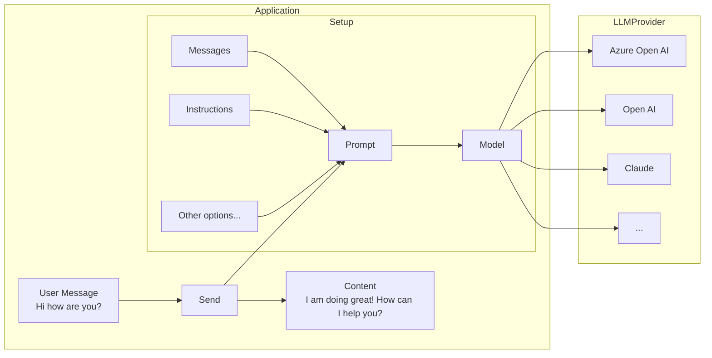

## Simple chat generation

Chat generation is the the most basic way of interacting with an LLM model. It involves setting up your ChatPrompt, the Model, and sending it the message.

Import the relevant objects:

```typescript

```

```typescript

// ...

app.on('message', async ({ send, activity, next, log }) => {
  const model = new OpenAIChatModel({
    apiKey: process.env.AZURE_OPENAI_API_KEY || process.env.OPENAI_API_KEY,
    endpoint: process.env.AZURE_OPENAI_ENDPOINT,
    apiVersion: process.env.AZURE_OPENAI_API_VERSION,
    model: process.env.AZURE_OPENAI_MODEL_DEPLOYMENT_NAME!,
  });

  const prompt = new ChatPrompt({
    instructions: 'You are a friendly assistant who talks like a pirate',
    model,
  });

  const response = await prompt.send(activity.text);
  if (response.content) {
    const activity = new MessageActivity(response.content).addAiGenerated();
    await send(activity);
    // Ahoy, matey! 🏴‍☠️ How be ye doin' this fine day on th' high seas? What can this ol' salty sea dog help ye with? 🚢☠️
  }
});
```

:::note
The current `OpenAIChatModel` implementation uses chat-completions API. The responses API is coming soon.
:::

## Streaming chat responses

LLMs can take a while to generate a response, so often streaming the response leads to a better, more responsive user experience.

:::warning
Streaming is only currently supported for single 1:1 chats, and not for groups or channels.
:::

```typescript

// ...

app.on('message', async ({ stream, send, activity, next, log }) => {
  // const query = activity.text;

  const prompt = new ChatPrompt({
    instructions: 'You are a friendly assistant who responds in extremely verbose language',
    model,
  });

  // Notice that we don't `send` the final response back, but
  // `stream` the chunks as they come in
  const response = await prompt.send(query, {
    onChunk: (chunk) => {
      stream.emit(chunk);
    },
  });

  if (activity.conversation.isGroup) {
    // If the conversation is a group chat, we need to send the final response
    // back to the group chat
    const activity = new MessageActivity(response.content).addAiGenerated();
    await send(activity);
  } else {
    // We wrap the final response with an AI Generated indicator
    stream.emit(new MessageActivity().addAiGenerated());
  }
});
```


---

### 🔍 Search commands

# 🔍 Search commands

Message extension search commands allow users to search external systems and insert the results of that search into a message in the form of a card.

## Search command invocation locations

There are two different areas search commands can be invoked from:

1. Compose Area
2. Compose Box

### Compose Area and Box


## Setting up your Teams app manifest

To use search commands you have to define them in the Teams app manifest. Here is an example:

```json
"composeExtensions": [
    {
        "botId": "${{BOT_ID}}",
        "commands": [
            {
                "id": "searchQuery",
                "context": [
                    "compose",
                    "commandBox"
                ],
                "description": "Test command to run query",
                "title": "Search query",
                "type": "query",
                "parameters": [
                    {
                        "name": "searchQuery",
                        "title": "Search Query",
                        "description": "Your search query",
                        "inputType": "text"
                    }
                ]
            }
        ]
    }
]
```

Here we are defining the `searchQuery` search (or query) command.

## Handle submission

Handle the search query submission when the `searchQuery` search command is invoked.

```typescript

// ...

app.on('message.ext.query', async ({ activity }) => {
  const { commandId } = activity.value;
  const searchQuery = activity.value.parameters![0].value;

  if (commandId == 'searchQuery') {
    const cards = await createDummyCards(searchQuery);
    const attachments = cards.map(({ card, thumbnail }) => {
      return {
        ...cardAttachment('adaptive', card), // expanded card in the compose box...
        preview: cardAttachment('thumbnail', thumbnail), // preview card in the compose box...
      };
    });

    return {
      composeExtension: {
        type: 'result',
        attachmentLayout: 'list',
        attachments: attachments,
      },
    };
  }

  return { status: 400 };
});
```

`createDummyCards()` function

```typescript

// ...

export async function createDummyCards(searchQuery: string) {
  const dummyItems = [
    {
      title: 'Item 1',
      description: `This is the first item and this is your search query: ${searchQuery}`,
    },
    { title: 'Item 2', description: 'This is the second item' },
    { title: 'Item 3', description: 'This is the third item' },
    { title: 'Item 4', description: 'This is the fourth item' },
    { title: 'Item 5', description: 'This is the fifth item' },
  ];

  const cards = dummyItems.map((item) => {
    return {
      card: new AdaptiveCard(
        new TextBlock(item.title, {
          size: 'Large',
          weight: 'Bolder',
          color: 'Accent',
          style: 'heading',
        }),
        new TextBlock(item.description, {
          wrap: true,
          spacing: 'Medium',
        })
      ),
      thumbnail: {
        title: item.title,
        text: item.description,
        // When a user clicks on a list item in Teams:
        // - If the thumbnail has a `tap` property: Teams will trigger the `message.ext.select-item` activity
        // - If no `tap` property: Teams will insert the full adaptive card into the compose box
        // tap: {
        //   type: "invoke",
        //   title: item.title,
        //   value: {
        //     "option": index,
        //   },
        // },
      } satisfies ThumbnailCard,
    };
  });

  return cards;
}
```

The search results include both a full adaptive card and a preview card. The preview card appears as a list item in the search command area:


When a user clicks on a list item the dummy adaptive card is added to the compose box:


To implement custom actions when a user clicks on a search result item, you can add the `tap` property to the preview card. This allows you to handle the click event with custom logic:

```typescript

// ...

app.on('message.ext.select-item', async ({ activity, send }) => {
  const { option } = activity.value;

  await send(`Selected item: ${option}`);

  return {
    status: 200,
  };
});
```

## Resources

- [Search command](https://learn.microsoft.com/en-us/microsoftteams/platform/messaging-extensions/how-to/search-commands/define-search-command?tabs=Teams-toolkit%2Cdotnet)
- [Just-In-Time Install](https://learn.microsoft.com/en-us/microsoftteams/platform/messaging-extensions/how-to/search-commands/universal-actions-for-search-based-message-extensions#just-in-time-install)

---

### 🗃️ Custom Logger

# 🗃️ Custom Logger

The `App` will provide a default logger, but you can also provide your own.
The default `Logger` instance will be set to `ConsoleLogger` from the `@microsoft/teams.common` package.

```typescript

// initialize app with custom console logger
// set to debug log level
const app = new App({
  logger: new ConsoleLogger('echo', { level: 'debug' }),
});

app.on('message', async ({ send, activity, log }) => {
  log.debug(activity);
  await send({ type: 'typing' });
  await send(`you said "${activity.text}"`);
});

(async () => {
  await app.start();
})();
```

## Log Levels

Available levels, from most to least severe: `error`, `warn`, `info`, `debug`, `trace`. The default is `info`. Setting `level: 'debug'` emits `error`, `warn`, `info`, and `debug` — but not `trace`.

## Filtering by Logger Name

Each logger is created with a name. You can filter which loggers emit output by providing a name pattern, using `*` as a wildcard.

Each logger has a name. The `pattern` option filters which loggers emit, with `*` as a wildcard. Prefix a pattern with `-` to exclude. Combine with commas.

```typescript
new ConsoleLogger('my-app', { pattern: '@teams*' });        // only SDK loggers
new ConsoleLogger('my-app', { pattern: '*,-@teams/http*' }); // everything except HTTP
```

## Environment Variables

The TypeScript SDK's `ConsoleLogger` reads two environment variables at construction:

| Variable     | Purpose                          | Example                 |
| ------------ | -------------------------------- | ----------------------- |
| `LOG_LEVEL`  | Minimum severity                 | `LOG_LEVEL=debug`       |
| `LOG`        | Logger name pattern (wildcards)  | `LOG=@teams*`           |

Env vars override options passed to the constructor. If you do not pass a logger to `App`, the SDK creates a default `ConsoleLogger` named `@teams/app` — so `LOG_LEVEL=debug` alone is enough to enable debug output.

> **Gotcha:** `LOG` is a name filter, not a toggle. Setting `LOG` to a pattern that doesn't match the default `@teams/app` (for example `LOG=my-app*`) silences the default logger. If in doubt, unset `LOG` to match everything.

## Child Loggers

Call `log.child('scope')` on an existing logger to get a scoped logger. Its name is `parent/scope`, and pattern/level are inherited.

```typescript
app.on('message', async ({ log }) => {
  const msgLog = log.child('message-handler');
  msgLog.debug('processing'); // logged as "@teams/app/message-handler"
});
```

---

### A2A Client

# A2A Client

## What is an A2A Client?

An A2A client is an agent or application that can proactively send tasks to A2A servers and interact with them using the A2A protocol.

## Using `A2AClient` Directly

For direct control over A2A interactions, you can use the `A2AClient` from the SDK:

```typescript

// Create client from agent card URL
const client = await A2AClient.fromCardUrl('http://localhost:4000/a2a/.well-known/agent-card.json');

// Send a message directly
const response = await client.sendMessage({
  message: {
    messageId: 'unique-id',
    role: 'user',
    parts: [{ kind: 'text', text: 'What is the weather?' }],
    kind: 'message',
  },
});
```

## Using `A2AClientPlugin` with ChatPrompt

A2A is most effective when used with an LLM. The `A2AClientPlugin` can be added to your chat prompt to allow interaction with A2A agents. Once added, the plugin will automatically configure the system prompt and tool calls to determine if the a2a server is needed for a particular task, and if so, it will do the work of orchestrating the call to the A2A server.

```typescript

const prompt = new ChatPrompt(
  {
    model: new OpenAIChatModel({
      apiKey: process.env.AZURE_OPENAI_API_KEY,
      model: process.env.AZURE_OPENAI_MODEL!,
      endpoint: process.env.AZURE_OPENAI_ENDPOINT,
      apiVersion: process.env.AZURE_OPENAI_API_VERSION,
    }),
  },
  // Add the A2AClientPlugin to the prompt
  [new A2AClientPlugin()]
)
  // Provide the agent's card URL
  .usePlugin('a2a', {
    key: 'my-weather-agent',
    cardUrl: 'http://localhost:4000/a2a/.well-known/agent-card.json',
  });
```

To send a message:

```typescript
// Now we can send the message to the prompt and it will decide if
// the a2a agent should be used or not and also manages contacting the agent
const result = await prompt.send(message);
```

### Advanced `A2AClientPlugin` Configuration

You can customize how the client interacts with A2A agents by providing custom builders:

```typescript
// Example with custom message builders and response processors
export const advancedPrompt = new ChatPrompt(
  {
    model: new OpenAIChatModel({
      apiKey: process.env.AZURE_OPENAI_API_KEY,
      model: process.env.AZURE_OPENAI_MODEL!,
      endpoint: process.env.AZURE_OPENAI_ENDPOINT,
      apiVersion: process.env.AZURE_OPENAI_API_VERSION,
    }),
  },
  [
    new A2AClientPlugin({
      // Custom function metadata builder
      buildFunctionMetadata: (card) => ({
        name: `ask${card.name.replace(/\s+/g, '')}`,
        description: `Ask ${card.name} about ${card.description || 'anything'}`,
      }),
      // Custom message builder - can return either Message or string
      buildMessageForAgent: (card, input) => {
        // Return a string - will be automatically wrapped in a Message
        return `[To ${card.name}]: ${input}`;
      },
      // Custom response processor
      buildMessageFromAgentResponse: (card, response) => {
        if (response.kind === 'message') {
          const textParts = response.parts
            .filter((part) => part.kind === 'text')
            .map((part) => part.text);
          return `${card.name} says: ${textParts.join(' ')}`;
        }
        return `${card.name} sent a non-text response.`;
      },
    }),
  ]
).usePlugin('a2a', {
  key: 'weather-agent',
  cardUrl: 'http://localhost:4000/a2a/.well-known/agent-card.json',
});
```

## Sequence Diagram

Here's how the A2A client works with `ChatPrompt` and `A2AClientPlugin`:

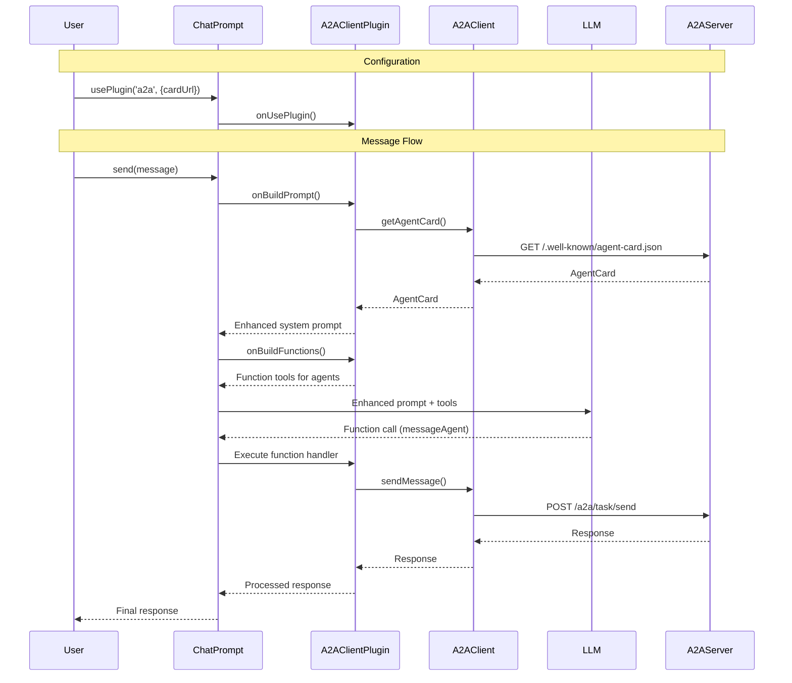

---

### Activity Type Reference

# Activity Type Reference

The application supports a number of activity types:

## Core Activity Routes

| Route            | Responsibility                                                                                  |
| ---------------- | ----------------------------------------------------------------------------------------------- |
| `message`        | User messages the app                                                                           |
| `typing`         | Sends a typing indicator to indicate the app got the user's message and is computing a response |
| `deleteUserData` | Triggered when a user requests their data to be deleted according to privacy regulations        |
| `mention`        | Triggered when the bot is @mentioned in a conversation                                          |

## Configuration Routes

| Route           | Invoke Path     | Responsibility                                                |
| --------------- | --------------- | ------------------------------------------------------------- |
| `config.open`   | `config/fetch`  | When app is installed, the user may configure it via a dialog |
| `config.submit` | `config/submit` | Configuration dialog submission                               |
| `tab.open`      | `tab/fetch`     | Initializes tab configuration experiences                     |
| `tab.submit`    | `tab/submit`    | Processes tab configuration submissions                       |

## Dialog Routes

| Route           | Invoke Path   | Responsibility               |
| --------------- | ------------- | ---------------------------- |
| `dialog.open`   | `task/fetch`  | Opens a dialog               |
| `dialog.submit` | `task/submit` | Processes dialog submissions |

## Authentication Routes

| Route                   | Invoke Path            | Responsibility                                |
| ----------------------- | ---------------------- | --------------------------------------------- |
| `signin.token-exchange` | `signin/tokenExchange` | When a token exchange happens during SSO Auth |
| `signin.verify-state`   | `signin/verifyState`   | When a verification passes after OAuth        |

## Message Interaction Routes

| Route             | Invoke Path                       | Responsibility                                                          |
| ----------------- | --------------------------------- | ----------------------------------------------------------------------- |
| `message.execute` | `actionableMessage/executeAction` | An action was executed on a message                                     |
| `message.submit`  | `message/submitAction`            | Handles message action submissions                                      |
| `card.action`     | `adaptiveCard/action`             | Triggered when a user interacts with an Adaptive Card button or control |

## File Handling Routes

| Route                  | Responsibility                                               |
| ---------------------- | ------------------------------------------------------------ |
| `file.consent`         | Manages file sharing permission workflows in Teams           |
| `file.consent.accept`  | Triggered when user accepts a file consent card for sharing  |
| `file.consent.decline` | Triggered when user declines a file consent card for sharing |

## Message Extension Routes

| Route                             | Invoke Path                            | Responsibility                                        |
| --------------------------------- | -------------------------------------- | ----------------------------------------------------- |
| `message.ext.query-link`          | `composeExtension/queryLink`           | A link unfurling request for an installed application |
| `message.ext.anon-query-link`     | `composeExtension/anonymousQueryLink`  | An anonymous link unfurling request                   |
| `message.ext.query`               | `composeExtension/query`               | Message extension search query                        |
| `message.ext.select-item`         | `composeExtension/selectItem`          | Message extension item selection                      |
| `message.ext.submit`              | `composeExtension/submitAction`        | Message extension action submission                   |
| `message.ext.open`                | `composeExtension/fetchTask`           | Message extension task fetching for an action         |
| `message.ext.query-settings-url`  | `composeExtension/querySettingUrl`     | Retrieves configuration URLs for message extensions   |
| `message.ext.setting`             | `composeExtension/setting`             | Processes message extension settings changes          |
| `message.ext.card-button-clicked` | `composeExtension/onCardButtonClicked` | Card button click handling in message extensions      |
| `message.ext.edit`                | N/A                                    | Processes edits to message extension previews         |
| `message.ext.send`                | N/A                                    | Handles sending of message extension content          |

## Lifecycle Routes

| Route            | Responsibility                                              |
| ---------------- | ----------------------------------------------------------- |
| `install.add`    | Triggered when the app is newly installed to a team or chat |
| `install.remove` | Triggered when the app is uninstalled from a team or chat   |
| `install.update` | Triggered when the app is updated in a team or chat         |
| `handoff.action` | Manages handoffs from a different agent to your application |

## Conversation Update Routes

| Route             | Responsibility                                                                       |
| ----------------- | ------------------------------------------------------------------------------------ |
| `membersAdded`    | Triggered when new users join a team or are added to a chat where the bot is active  |
| `membersRemoved`  | Triggered when users leave a team or are removed from a chat where the bot is active |
| `channelCreated`  | Triggered when a new channel is created in a team where the bot is installed         |
| `channelRenamed`  | Triggered when a channel is renamed in a team where the bot is installed             |
| `channelDeleted`  | Triggered when a channel is deleted from a team where the bot is installed           |
| `channelRestored` | Triggered when a previously deleted channel is restored                              |
| `teamArchived`    | Triggered when a team is archived                                                    |
| `teamDeleted`     | Triggered when a team is deleted where the bot is installed                          |
| `teamHardDeleted` | Triggered when a team is permanently deleted (beyond recovery)                       |
| `teamRenamed`     | Triggered when a team is renamed where the bot is installed                          |
| `teamRestored`    | Triggered when a previously deleted team is restored                                 |
| `teamUnarchived`  | Triggered when a team is unarchived                                                  |
| `messageUpdate`   | Triggered when a message is edited in a conversation with the bot                    |
| `messageDelete`   | Triggered when a message is deleted in a conversation with the bot                   |

## Meeting Routes

| Route                     | Invoke Path                                         | Responsibility                                                             |
| ------------------------- | --------------------------------------------------- | -------------------------------------------------------------------------- |
| `meetingStart`            | `application/vnd.microsoft.meetingStart`            | Triggered at the beginning of a Teams meeting where the bot is present     |
| `meetingEnd`              | `application/vnd.microsoft.meetingEnd`              | Triggered at the end of a Teams meeting where the bot is present           |
| `meetingParticipantJoin`  | `application/vnd.microsoft.meetingParticipantJoin`  | Triggered when participants join a Teams meeting where the bot is present  |
| `meetingParticipantLeave` | `application/vnd.microsoft.meetingParticipantLeave` | Triggered when participants leave a Teams meeting where the bot is present |
| `readReceipt`             | `application/vnd.microsoft.readReceipt`             | Tracks when messages are read by users                                     |

---

### Code Basics

# Code Basics

After following the guidance in [the quickstart](quickstart.txt) to create your first Teams application, let's review its structure and key components. This knowledge can help you build more complex applications as you progress.

## Project Structure

When you create a new Teams application, it generates a directory with this basic structure:

```
quote-agent/
|── appPackage/       # Teams app package files
├── src/
│   └── index.ts      # Main application code
```

- **appPackage/**: Contains the Teams app package files, including the `manifest.json` file and icons. This is required for [sideloading](https://learn.microsoft.com/en-us/microsoftteams/platform/concepts/deploy-and-publish/apps-upload) the app into Teams for testing. The app manifest defines the app's metadata, capabilities, and permissions.
- **src/**: Contains the main application code. The `index.ts` file is the entry point for your application.

## Core Components

Let's break down the simple application from the [quickstart](quickstart.txt) into its core components.

### The App Class

The heart of an application is the `App` class. This class handles all incoming activities and manages the application's lifecycle. It also acts as a way to host your application service.

```typescript title="src/index.ts"

const app = new App({
  plugins: [new DevtoolsPlugin()],
});
```

The app configuration includes a variety of options that allow you to customize its behavior, including controlling the underlying server, authentication, and other settings.

### Plugins

Plugins are a core part of the Teams SDK. They allow you to hook into various lifecycles of the application. The lifecycles include server events (start, stop, initialize, etc.), and also Teams Activity events (onActivity, onActivitySent, etc.).

### Message Handling

Teams applications respond to various types of activities. The most basic is handling messages:

```typescript title="src/index.ts"
app.on('message', async ({ send, activity }) => {
  await send({ type: 'typing' });
  await send(`you said "${activity.text}"`);
});
```

This code:

1. Listens for all incoming messages using `app.on('message')`.
2. Sends a typing indicator, which renders as an animated ellipsis (…) in the chat.
3. Responds by echoing back the received message.

:::info
Type safety is a core tenet of this version of the SDK. You can change the activity `name` to a different supported value, and the type system will automatically adjust the type of activity to match the new value.
:::

### Application Lifecycle

Your application starts when you run:

```typescript title="src/index.ts"
await app.start();
```

This code initializes your application server and, when configured for Teams, also authenticates it to be ready for sending and receiving messages.

## Next Steps

Now that you understand the basic structure of your Teams application, you're ready to [run it in Teams](running-in-teams.txt). You'll use the Teams CLI to register your bot and sideload it into Teams.

After that, you can:

- Add more activity handlers for different types of interactions. See [Listening to Activities](../essentials/on-activity) for more details.
- Integrate with external services using the [API Client](../essentials/api).
- Add interactive [cards](../in-depth-guides/adaptive-cards) and [dialogs](../in-depth-guides/dialogs).

Continue on to the next page to learn about these advanced features.

## Other Resources

- [Essentials](../essentials)
- [Teams concepts](/teams)
- [Teams developer tools](/developer-tools)

---

### Dialogs

# Dialogs

Dialogs are a helpful paradigm in Teams which improve interactions between your agent and users. When dialogs are **invoked**, they pop open a window for a user in the Teams client. The content of the dialog can be supplied by the agent application.

:::note
In Teams client v1, dialogs were called task modules. They may occasionaly be used synonymously.
:::

## Key benefits

1. Dialogs pop open for a user in the Teams client. This means in group-settings, dialog actions are not visible to other users in the channel, reducing clutter.

2. Interactions like filling out complex forms, or multi-step forms where each step depends on the previous step are excellent use cases for dialogs.

3. The content for the dialog can be hard-coded in, or fetched at runtime. This makes them extremely flexible and powerful.

## Resources

- [Task Modules](https://learn.microsoft.com/en-us/microsoftteams/platform/task-modules-and-cards/what-are-task-modules)
- [Invoking Task Modules](https://learn.microsoft.com/en-us/microsoftteams/platform/task-modules-and-cards/task-modules/invoking-task-modules)

---

### Essentials

# Essentials

At its core, an application that hosts an agent on Microsoft Teams exists to do three things well: listen to events, handle the ones that matter, and respond efficiently. Whether a user sends a message, opens a dialog, or clicks a button — your app is there to interpret the event and act on it.

With Teams SDK, we've made it easier than ever to build this kind of reactive, conversational logic. The SDK introduces a few simple but powerful paradigms to help you connect to Teams, register handlers, and build intelligent agent behaviors quickly.

Before diving in, let's define a few key terms:

- Event: Anything interesting that happens on Teams — or within your application as a result of handling an earlier event.
- Activity: A special type of Teams-specific event. Activities include things like messages, reactions, and adaptive card actions.
- InvokeActivity: A specific kind of activity triggered by user interaction (like submitting a form), which may or may not require a response.
- Handler: The logic in your application that reacts to events or activities. Handlers decide what to do, when, and how to respond.

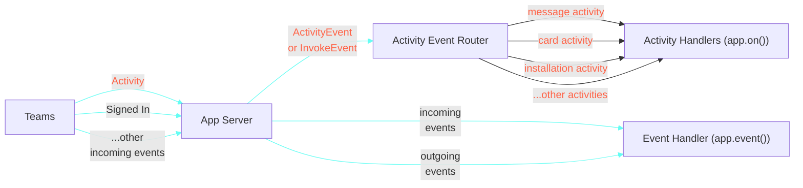

This section will walk you through the foundational pieces needed to build responsive, intelligent agents using the SDK.

---

### Executing Actions

# Executing Actions

Adaptive Cards support interactive elements through **actions**—buttons, links, and input submission triggers that respond to user interaction.
You can use these to collect form input, trigger workflows, show task modules, open URLs, and more.

## Action Types

The Teams SDK supports several action types for different interaction patterns:

| Action Type               | Purpose                | Description                                                                  |
| ------------------------- | ---------------------- | ---------------------------------------------------------------------------- |
| `Action.Execute`          | Server‑side processing | Send data to your bot for processing. Best for forms & multi‑step workflows. |
| `Action.Submit`           | Simple data submission | Legacy action type. Prefer `Execute` for new projects.                       |
| `Action.OpenUrl`          | External navigation    | Open a URL in the user's browser.                                            |
| `Action.ShowCard`         | Progressive disclosure | Display a nested card when clicked.                                          |
| `Action.ToggleVisibility` | UI state management    | Show/hide card elements dynamically.                                         |

:::info
For complete reference, see the [official documentation](https://adaptivecards.microsoft.com/?topic=Action.Execute).
:::

## Creating Actions with the SDK

### Single Actions

The SDK provides builder helpers that abstract the underlying JSON. For example:

```typescript

// ...

new ExecuteAction({ title: 'Submit Feedback' })
  .withData({ action: 'submit_feedback' })
  .withAssociatedInputs('auto'),
```

### Action Sets

Group actions together using `ActionSet`:

```typescript

// ...

new ActionSet(
  new ExecuteAction({ title: 'Submit Feedback' })
    .withData({ action: 'submit_feedback' })
    .withAssociatedInputs('auto'),
  new OpenUrlAction('https://adaptivecards.microsoft.com').withTitle('Learn More')
);
```

### Raw JSON Alternative

Just like when building cards, if you prefer to work with raw JSON, you can do just that. You get type safety for free in TypeScript.

```typescript

// ...

{
  type: 'Action.OpenUrl',
  url: 'https://adaptivecards.microsoft.com',
  title: 'Learn More',
} as const satisfies IOpenUrlAction
```

## Working with Input Values

### Associating data with the cards

Sometimes you want to send a card and have it be associated with some data. Set the `data` value to be sent back to the client so you can associate it with a particular entity.

```typescript

  AdaptiveCard,
  TextInput,
  ToggleInput,
  ActionSet,
  ExecuteAction,
} from '@microsoft/teams.cards';
// ...

function editProfileCard() {
  const card = new AdaptiveCard(
    new TextInput({ id: 'name' }).withLabel('Name').withValue('John Doe'),
    new TextInput({ id: 'email', label: 'Email', value: 'john@contoso.com' }),
    new ToggleInput('Subscribe to newsletter').withId('subscribe').withValue('false'),
    new ActionSet(
      new ExecuteAction({ title: 'Save' })
        .withData({
          action: 'save_profile',
          entityId: '12345', // This will come back once the user submits
        })
        .withAssociatedInputs('auto')
    )
  );

  // Data received in handler
  /**
  {
    action: "save_profile",
    entityId: "12345",     // From action data
    name: "John Doe",      // From name input
    email: "john@doe.com", // From email input
    subscribe: "true"      // From toggle input (as string)
  }
  */

  return card;
}
```

### Input Validation

Input Controls provide ways for you to validate. More details can be found on the Adaptive Cards [documentation](https://adaptivecards.microsoft.com/?topic=input-validation).

```typescript

  AdaptiveCard,
  NumberInput,
  TextInput,
  ActionSet,
  ExecuteAction,
} from '@microsoft/teams.cards';
// ...

function createProfileCardInputValidation() {
  const ageInput = new NumberInput({ id: 'age' })
    .withLabel('Age')
    .withIsRequired(true)
    .withMin(0)
    .withMax(120);

  const nameInput = new TextInput({ id: 'name' })
    .withLabel('Name')
    .withIsRequired()
    .withErrorMessage('Name is required!'); // Custom error messages
  const card = new AdaptiveCard(
    nameInput,
    ageInput,
    new TextInput({ id: 'location' }).withLabel('Location'),
    new ActionSet(
      new ExecuteAction({ title: 'Save' })
        .withData({
          action: 'save_profile',
        })
        .withAssociatedInputs('auto') // All inputs should be validated
    )
  );

  return card;
}
```

## Routing & Handlers

### Using SubmitData

The SDK provides a `SubmitData` helper that sets the routing key for your action. This is the recommended way to wire up actions to specific handlers:

```typescript

// ...

new ExecuteAction({ title: 'Submit Feedback' })
  .withData(new SubmitData('submit_feedback'))
  .withAssociatedInputs('auto')

// You can also pass extra static data alongside the action name
new ExecuteAction({ title: 'Save' })
  .withData(new SubmitData('save_profile', { entityId: '12345' }))
  .withAssociatedInputs('auto')
```

`SubmitData` sets a reserved `action` key in the card's data payload. When the user clicks the button, the SDK router reads this key to dispatch to the matching handler.

### Action-Specific Handlers

Register handlers for specific actions. When you use `SubmitData` to set the action name on the card, the SDK routes directly to the matching handler:

```typescript

// ...

// 'submit_feedback' matches the identifier passed to SubmitData('submit_feedback')
app.on('card.action.submit_feedback', async ({ activity, send }) => {
  const data = activity.value.action.data;
  await send(`Feedback received: ${data.feedback}`);
  return {
    statusCode: 200,
    type: 'application/vnd.microsoft.activity.message',
    value: 'Action processed successfully',
  };
});

app.on('card.action.save_profile', async ({ activity, send }) => {
  const data = activity.value.action.data;
  await send(`Profile saved!\nName: ${data.name}\nEmail: ${data.email}`);
  return {
    statusCode: 200,
    type: 'application/vnd.microsoft.activity.message',
    value: 'Action processed successfully',
  };
});
```

The route name follows the pattern `card.action.<action-name>`, where `<action-name>` matches the value passed to `SubmitData`. This is cleaner than a catch-all with a switch statement, and scales better as you add more actions.

### Catch-All Handler

If you need to handle all card actions in one place, you can use the catch-all handler:

```typescript

  AdaptiveCardActionErrorResponse,
  AdaptiveCardActionMessageResponse,
} from '@microsoft/teams.api';

// ...

app.on('card.action', async ({ activity, send }) => {
  const data = activity.value?.action?.data;
  if (!data?.action) {
    return {
      statusCode: 400,
      type: 'application/vnd.microsoft.error',
      value: {
        code: 'BadRequest',
        message: 'No action specified',
        innerHttpError: {
          statusCode: 400,
          body: { error: 'No action specified' },
        },
      },
    } satisfies AdaptiveCardActionErrorResponse;
  }

  console.debug('Received action data:', data);

  switch (data.action) {
    case 'submit_feedback':
      await send(`Feedback received: ${data.feedback}`);
      break;

    case 'purchase_item':
      await send(`Purchase request received for game: ${data.choiceGameSingle}`);
      break;

    case 'save_profile':
      await send(
        `Profile saved!\nName: ${data.name}\nEmail: ${data.email}\nSubscribed: ${data.subscribe}`
      );
      break;

    default:
      return {
        statusCode: 400,
        type: 'application/vnd.microsoft.error',
        value: {
          code: 'BadRequest',
          message: 'Unknown action',
          innerHttpError: {
            statusCode: 400,
            body: { error: 'Unknown action' },
          },
        },
      } satisfies AdaptiveCardActionErrorResponse;
  }

  return {
    statusCode: 200,
    type: 'application/vnd.microsoft.activity.message',
    value: 'Action processed successfully',
  } satisfies AdaptiveCardActionMessageResponse;
});
```

:::note
The `data` values are not typed and come as `any`, so you will need to cast them to the correct type in this case.
:::

---

### Handling Dialog Submissions

# Handling Dialog Submissions

When a user submits a form inside a dialog, your app receives a `dialog.submit` event. Use `dialog.submit.<action>` to handle a specific submission (where `action` matches the value passed via `SubmitData`), or `dialog.submit` for a catch-all. You can either send a response or proceed to more steps in the dialog (see [Multi-step Dialogs](./handling-multi-step-forms)).

In this example, we show how to handle dialog submissions from an Adaptive Card form:

```typescript

// ...

// The "action" field in SubmitData('simple_form') routes here
app.on('dialog.submit.simple_form', async ({ activity, send }) => {
  const name = activity.value.data.name;
  await send(`Hi ${name}, thanks for submitting the form!`);
  return {
    task: {
      type: 'message',
      // This appears as a final message in the dialog
      value: 'Form was submitted',
    },
  };
});
```

Similarly, handling dialog submissions from rendered webpages is also possible:

```typescript

// ...

// Webpage submissions route the same way — the webpage must include
// the "action" field in the data passed to microsoftTeams.tasks.submitTask()
app.on('dialog.submit.webpage_dialog', async ({ activity, send }) => {
  const name = activity.value.data.name;
  const email = activity.value.data.email;
  await send(`Hi ${name}, thanks for submitting the form! We got that your email is ${email}`);
  // Return status 200 to close the dialog without showing a message
  return {
    status: 200,
  };
});
```

---

### Listening To Events

# Listening To Events

An **event** is a foundational concept in building agents — it represents something noteworthy happening either on Microsoft Teams or within your application. These events can originate from the user (e.g. installing or uninstalling your app, sending a message, submitting a form), or from your application server (e.g. startup, error in a handler).

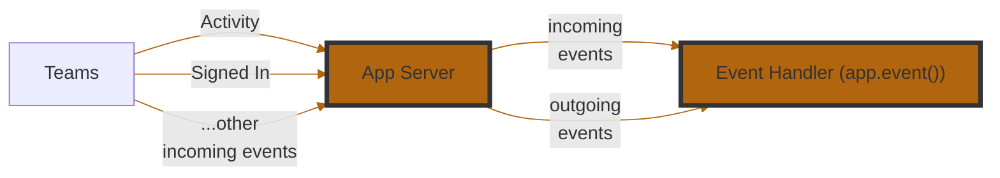

The Teams SDK makes it easy to subscribe to these events and respond appropriately. You can register event handlers to take custom actions when specific events occur — such as logging errors, triggering workflows, or sending follow-up messages.

Here are the events that you can start building handlers for:

| **Event Name**      | **Description**                                                                |
| ------------------- | ------------------------------------------------------------------------------ |
| `start`             | Triggered when your application starts. Useful for setup or boot-time logging. |
| `signin`            | Triggered during a sign-in flow via Teams.                                     |
| `error`             | Triggered when an unhandled error occurs in your app. Great for diagnostics.   |
| `activity`          | A catch-all for incoming Teams activities (messages, commands, etc.).          |
| `activity.response` | Triggered when your app sends a response to an activity. Useful for logging.   |
| `activity.sent`     | Triggered when an activity is sent (not necessarily in response).              |

### Example 1

We can subscribe to errors that occur in the app.

```typescript
app.event('error', ({ error }) => {
  app.log.error(error);
  // Or Alternatively, send it to an observability platform
});
```

### Example 2

When a user signs in using `OAuth` or `SSO`, use the graph api to fetch their profile and say hello.

```typescript

app.event('signin', async ({ activity, send, userGraph }) => {
  const me = await userGraph.call(endpoints.me.get);
  await send(`👋 Hello ${me.name}`);
});
```

---

### MCP Client

# MCP Client

You are able to leverage other MCP servers that expose tools via the Streamable HTTP protocol as part of your application. This allows your AI agent to use remote tools to accomplish tasks.

Install it to your application:

```bash
npm install @microsoft/teams.mcpclient
```

:::info
Take a look at [Function calling](../function-calling) to understand how the `ChatPrompt` leverages tools to enhance the LLM's capabilities. MCP extends this functionality by allowing remote tools, that may or may not be developed or maintained by you, to be used by your application.
:::

## Remote MCP Server

The first thing that's needed is access to a **remote** MCP server. MCP Servers (at present) come using two main types protocols:

1. StandardIO - This is a _local_ MCP server, which runs on your machine. An MCP client may connect to this server, and use standard input and outputs to communicate with it. Since our application is running remotely, this is not something that we want to use
2. Streamable HTTP/SSE - This is a _remote_ MCP server. An MCP client may
   send it requests and the server responds in the expected MCP protocol.

For hooking up to your valid remote server, you will need to know the URL of the server, and if applicable, and keys that must be included as part of the header.

## MCP Client Plugin

The `MCPClientPlugin` (from `@microsoft/teams.mcpclient` package) integrates directly with the `ChatPrompt` object as a plugin. When the `ChatPrompt`'s `send` function is called, it calls the external MCP server and loads up all the tools that are available to it.

Once loaded, it treats these tools like any functions that are available to the `ChatPrompt` object. If the LLM then decides to call one of these remote MCP tools, the MCP Client plugin will call the remote MCP server and return the result back to the LLM. The LLM can then use this result in its response.

```typescript

// ...

const logger = new ConsoleLogger('mcp-client', { level: 'debug' });
const prompt = new ChatPrompt(
  {
    instructions: 'You are a helpful assistant. You MUST use tool calls to do all your work.',
    model: new OpenAIChatModel({
      model: 'gpt-4o-mini',
      apiKey: process.env.OPENAI_API_KEY,
    }),
  },
  [new McpClientPlugin({ logger })]
).usePlugin('mcpClient', {
  url: 'https://learn.microsoft.com/api/mcp',
});

const app = new App();

app.on('message', async ({ send, activity }) => {
  await send({ type: 'typing' });

  const result = await prompt.send(activity.text);
  if (result.content) {
    await send(result.content);
  }
});
app.start().catch(console.error);
```

### Customize Headers

Some MCP servers may require custom headers to be sent as part of the request. You can customize the headers when calling the `usePlugin` function:

```typescript

// ...

.usePlugin('mcpClient', {
    url: 'https://<your-mcp-server>/mcp'
    params: {
      headers: {
        'x-header-functions-key': '<custom-headers>',
      }
    }
});
```

In this example, we augment the `ChatPrompt` with a few remote MCP Servers.

:::note
Feel free to build an MCP Server in a different agent using the [MCP Server Guide](./mcp-server). Or you can quickly set up an MCP server using [Azure Functions](https://techcommunity.microsoft.com/blog/appsonazureblog/build-ai-agent-tools-using-remote-mcp-with-azure-functions/4401059).
:::


In this example, our MCP server is a Pokemon API and our client knows how to call it. The LLM is able to call the `getPokemon` function exposed by the server and return the result back to the user.

---

### Self-Managing Your Server

# Self-Managing Your Server

By default, `app.start()` spins up an HTTP server, registers the Teams endpoint, and manages the full lifecycle for you. Under the hood, the SDK uses [Express](https://expressjs.com/) as its built-in HTTP framework. But if you need to self-manage your server — because you have an existing app, need custom server configuration (TLS, workers, middleware), or use a different HTTP framework — the SDK supports that through the `HttpServerAdapter` interface.

## How It Works

The SDK splits HTTP handling into two layers:

- **HttpServer** handles Teams protocol concerns: JWT authentication, activity parsing, and routing to your handlers.
- **HttpServerAdapter** handles framework concerns: translating between your HTTP framework's request/response model and the SDK's pure handler pattern.

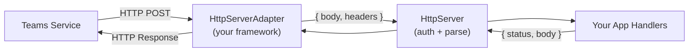

The adapter interface is intentionally simple — implement `registerRoute` and the SDK handles the rest.

## The Adapter Interface

```typescript
interface IHttpServerAdapter {
  registerRoute(method: HttpMethod, path: string, handler: HttpRouteHandler): void;
  serveStatic?(path: string, directory: string): void;
  start?(port: number): Promise<void>;
  stop?(): Promise<void>;
}

type HttpRouteHandler = (request: { body: unknown; headers: Record<string, string | string[]> })
  => Promise<{ status: number; body?: unknown }>;
```

- **`registerRoute`** — Required. Routes are registered dynamically (`/api/messages`, `/api/functions/name`, etc.).
- **`serveStatic`** — Optional. Only needed for tabs or static pages.
- **`start` / `stop`** — Optional. Omit when you manage the server lifecycle yourself.

## Self-Managing Your Server

To add Teams to an existing server:

1. Create your server with your own routes and middleware.
2. Wrap it in an adapter (or use the built-in one with your server instance).
3. Call `app.initialize()` — this registers the Teams routes on your server. Do **not** call `app.start()`.
4. Start the server yourself.

```typescript

// 1. Create your Express app with your own routes
const expressApp = express();
const httpServer = http.createServer(expressApp);

expressApp.get('/health', (_req, res) => {
  res.json({ status: 'healthy' });
});

// 2. Wrap it in the ExpressAdapter
const adapter = new ExpressAdapter(httpServer);

// 3. Create the Teams app with the adapter
const app = new App({ httpServerAdapter: adapter });

app.on('message', async ({ send, activity }) => {
  await send(`Echo: ${activity.text}`);
});

// 4. Initialize — registers /api/messages on your Express app (does NOT start a server)
await app.initialize();

// 5. Start the server yourself
httpServer.listen(3978, () => console.log('Server ready on http://localhost:3978'));
```

> See the full [Express adapter example](https://github.com/microsoft/teams.ts/tree/main/examples/http-adapters/express)

## Using a Different Framework

If you use a framework other than the built-in default, implement the adapter interface for your framework. The core work is in `registerRoute` — translate incoming requests to ` body, headers `, call the handler, and write the response back. Since you manage the server lifecycle yourself, `start`/`stop` aren't needed. And `serveStatic` is only required if you serve tabs or static pages.

Here is a Restify adapter — only `registerRoute` is needed:

```typescript

class RestifyAdapter implements IHttpServerAdapter {
  constructor(private server: restify.Server) {
    this.server.use(restify.plugins.bodyParser());
  }

  registerRoute(method: HttpMethod, path: string, handler: HttpRouteHandler): void {
    // Teams only sends POST requests to your bot endpoint
    assert(method === 'POST', `Unsupported method: ${method}`);
    this.server.post(path, async (req: restify.Request, res: restify.Response) => {
      const response = await handler({
        body: req.body,
        headers: req.headers as Record<string, string | string[]>,
      });
      res.send(response.status, response.body);
    });
  }
}
```

Usage:

```typescript
const server = restify.createServer();
const adapter = new RestifyAdapter(server);
const app = new App({ httpServerAdapter: adapter });
await app.initialize();
server.listen(3978);
```

> See the full implementation: [Restify adapter example](https://github.com/microsoft/teams.ts/tree/main/examples/http-adapters/restify)

---

### Using The App

# Using The App

The `@microsoft/teams.client` App class helps solve common challenges when building Single Page Applications hosted in Microsoft Teams, Outlook, and Microsoft 365. It is the client-side counterpart to the `@microsoft/teams.app` App that you can use to build AI agents.

These two App classes are designed to work well together. For instance, when you use the `@microsoft/teams.app` App to expose a server-side function, you can then use the `@microsoft/teams.client` App `exec` method to easily invoke that function, as the client-side app knows how to construct an HTTP request that the server-side app can process. It can issue a request to the right URL, with the expected payload and contextual headers. The client-side app even includes a bearer token that the server side app uses to authenticate the caller.

# Starting the app

To use the `@microsoft/teams.client` package, you first create an App instance and then call `app.start()`.

```typescript

const app = new App(clientId);
await app.start();
```

The app constructor strives to make it easy to get started on a new app, while still being flexible enough that it can integrate easily with existing apps.

The constructor takes two arguments: a required app client ID, and an optional `AppOptions` argument. The app client ID is the AAD app registration **Application (client) ID**. The options can be used to customize observability, Microsoft Authentication Library (MSAL) configuration, and
remote agent function calling.

For more details on the app options, see the [App options](./app-options) page.

## What happens during start

The app constructor does the following:

- it creates an app logger, if none is provided in the app options.
- it creates an http client used to call the remote agent.
- it creates a graph client that can be used as soon as the app is started.

The `app.start()` call does the following:

- it initializes TeamsJS.
- it creates an MSAL instance, if none is provided in the app options.
- it connects the MSAL instance to the graph client.
- it prompts the user for MSAL token consent, if needed and if pre-warming is not disabled through the app options.

## Using the app

When the `app.start()` call has completed, you can use the app instance to call Graph APIs and to call remote agent functions using the `exec()` function, or directly by using the `app.http` HTTP client. TeamsJS is now initialized, so you can interact with the hosting app. The `app.msalInstance` is now populated, in case you need to use the same MSAL for other purposes.

```typescript

const app = new App(clientId);
await app.start();

// you can now get the TeamsJS context...
const context = await teamsJs.app.getContext();

// ...call Graph end points...
const presenceResult = await app.graph.call(endpoints.me.presence.get);

// ...and call remote agent functions...
const agentResult = await app.exec<string>('hello-world');
```

---

### ⚙️ Settings

# ⚙️ Settings

You can add a settings page that allows users to configure settings for your app.

The user can access the settings by right-clicking the app item in the compose box.

<br />


This guide will show how to enable user access to settings, as well as setting up a page that looks like this:


## 1. Update the Teams Manifest

Set the `canUpdateConfiguration` field to `true` in the desired message extension under `composeExtensions`.

```json
"composeExtensions": [
    {
        "botId": "${{BOT_ID}}",
        "canUpdateConfiguration": true,
        ...
    }
]
```

## 2. Serve the settings `html` page

This is the code snippet for the settings `html` page:

```html
<html>
  <body>
    <form>
      <fieldset>
        <legend>What programming language do you prefer?</legend>
        <input type="radio" name="selectedOption" value="typescript" />Typescript<br />
        <input type="radio" name="selectedOption" value="csharp" />C#<br />
      </fieldset>

      <br />
      <input type="button" onclick="onSubmit()" value="Save" /> <br />
    </form>

    <script
      src="https://res.cdn.office.net/teams-js/2.34.0/js/MicrosoftTeams.min.js"
      integrity="sha384-brW9AazbKR2dYw2DucGgWCCcmrm2oBFV4HQidyuyZRI/TnAkmOOnTARSTdps3Hwt"
      crossorigin="anonymous"
    ></script>

    <script type="text/javascript">
      document.addEventListener('DOMContentLoaded', function () {
        // Get the selected option from the URL
        var urlParams = new URLSearchParams(window.location.search);
        var selectedOption = urlParams.get('selectedOption');
        if (selectedOption) {
          var checkboxes = document.getElementsByName('selectedOption');
          for (var i = 0; i < checkboxes.length; i++) {
            var thisCheckbox = checkboxes[i];
            if (selectedOption.includes(thisCheckbox.value)) {
              checkboxes[i].checked = true;
            }
          }
        }
      });
    </script>

    <script type="text/javascript">
      // initialize the Teams JS SDK
      microsoftTeams.app.initialize();

      // Run when the user clicks the submit button
      function onSubmit() {
        var newSettings = '';

        var checkboxes = document.getElementsByName('selectedOption');

        for (var i = 0; i < checkboxes.length; i++) {
          if (checkboxes[i].checked) {
            newSettings = checkboxes[i].value;
          }
        }

        // Closes the settings page and returns the selected option to the bot
        microsoftTeams.authentication.notifySuccess(newSettings);
      }
    </script>
  </body>
</html>
```

Save it in the `index.html` file in the same folder as where your app is initialized.

You can serve it by adding the following code to your app:

```typescript

// ...

app.tab('settings', path.resolve(__dirname));
```

:::note
This will serve the HTML page to the `$BOT_ENDPOINT/tabs/settings` endpoint as a tab. See [Tabs Guide](../tabs) to learn more.
:::

## 3. Specify the URL to the settings page

To enable the settings page, your app needs to handle the `message.ext.query-settings-url` activity that Teams sends when a user right-clicks the app in the compose box. Your app must respond with the URL to your settings page. Here's how to implement this:

```typescript

// ...

app.on('message.ext.query-settings-url', async ({ activity }) => {
  // Get user settings from storage if available
  const userSettings = (await app.storage.get(activity.from.id)) || { selectedOption: '' };
  const escapedSelectedOption = encodeURIComponent(userSettings.selectedOption);

  return {
    composeExtension: {
      type: 'config',
      suggestedActions: {
        actions: [
          {
            type: 'openUrl',
            title: 'Settings',
            // ensure BOT_ENDPOINT is set in your .env (Teams CLI does not populate it by default).
            value: `${process.env.BOT_ENDPOINT}/tabs/settings?selectedOption=${escapedSelectedOption}`,
          },
        ],
      },
    },
  };
});
```

## 4. Handle Form Submission

When a user submits the settings form, Teams sends a `message.ext.setting` activity with the selected option in the `activity.value.state` property. Handle it to save the user's selection:

```typescript

// ...

app.on('message.ext.setting', async ({ activity, send }) => {
  const { state } = activity.value;
  if (state == 'CancelledByUser') {
    return {
      status: 400,
    };
  }
  const selectedOption = state;

  // Save the selected option to storage
  await app.storage.set(activity.from.id, { selectedOption });

  await send(`Selected option: ${selectedOption}`);

  return {
    status: 200,
  };
});
```

---

### 📖 Message Extensions

# 📖 Message Extensions

Message extensions (or Compose Extensions) allow your application to hook into messages that users can send or perform actions on messages that users have already sent. They enhance user productivity by providing quick access to information and actions directly within the Teams interface. Users can search or initiate actions from the compose message area, the command box, or directly from a message, with the results returned as richly formatted cards that make information more accessible and actionable.

There are two types of message extensions: [API-based](https://learn.microsoft.com/en-us/microsoftteams/platform/messaging-extensions/api-based-overview) and [Bot-based](https://learn.microsoft.com/en-us/microsoftteams/platform/messaging-extensions/build-bot-based-message-extension?tabs=search-commands). API-based message extensions use an OpenAPI specification that Teams directly queries, requiring no additional application to build or maintain, but offering less customization. Bot-based message extensions require building an application to handle queries, providing more flexibility and customization options. This SDK supports bot-based message extensions only.

## Resources

- [What are message extensions?](https://learn.microsoft.com/en-us/microsoftteams/platform/messaging-extensions/what-are-messaging-extensions?tabs=desktop)

---

### App Options

# App Options

The app options offer various settings that you can use to customize observability, Microsoft Authentication Library (MSAL) configuration, and
remote agent function calling. Each setting is optional, with the app using a reasonable default as needed.

## Logger

If no logger is specified in the app options, the app will create a [ConsoleLogger](../observability/logging). You can however provide your own logger implementation to control log level and destination.

```typescript

const app = new App(clientId, {
  logger: new ConsoleLogger('myTabApp', { level: 'debug' }),
});

await app.start();
```

## Remote API options

The remote API options let you control which endpoint that `app.exec()` make a request to, as well as the default resource name to use when requesting an MSAL token to attach to the request.

### Base URL

The `baseUrl` value is used to provide the URL where the remote API is hosted. This can be omitted if the tab app is hosted on the same domain as the remote agent.

```typescript

const app = new App(clientId, {
  remoteApiOptions: {
    baseUrl: 'https://agent1.contoso.com',
  },
});
await app.start();

// this requests a token for 'api://<clientId>/access_as_user' and attaches
// that to a request to https://agent1.contoso.com/api/functions/my-function
await app.exec('my-function');
```

### Remote app resource

The `remoteAppResource` value is used to control the default resource name used when building a token request for the Entra token to include when invoking the function. This can be omitted if the tab app and the remote agent app are in the same AAD app, but should be provided if they're in different apps or the agent requires scopes for a different resource than the default `api://<clientId>/access_as_user`.

```typescript

const app = new App(clientId, {
  remoteApiOptions: {
    baseUrl: 'https://agent1.contoso.com',
    remoteAppResource: 'api://agent1ClientId',
  },
});
await app.start();

// this requests a token for 'api://agent1ClientId/access_as_user' and attaches that
// to a request to https://agent1.contoso.com/api/functions/my-function
await app.exec('my-function');
```

## MSAL options

The MSAL options let you control how the Microsoft Authentication Library (MSAL) is initialized and used, and how the user is prompted for scope consent as the app starts.

### MSAL instance and configuration

You have three options to control the MSAL instance used by the app.

- Provide a pre-configured and pre-initialized MSAL IPublicClientApplication.
- Provide a custom MSAL configuration for the app to use when creating an MSAL IPublicClientApplication instance.
- Provide neither, and let the app create IPublicClientApplication from a default MSAL configuration.

#### Default behavior

If the app options contain neither an MSAL instance nor an MSAL configuration, the app constructs a simple MSAL configuration that is suitable for multi-tenant apps and that connects the MSAL logger callbacks to the app logger.

```typescript

const app = new App(clientId);

await app.start();
// app.msalInstance is now available, and any logging is forwarded from
// MSAL to the app.log instance.
```

#### Providing a custom MSAL configuration

MSAL offers a rich set of configuration options, and you can provide your own configuration as an app option.

```typescript

const configuration: msal.Configuration = {
  /* custom MSAL configuration options */
};

const app = new App(clientId, { msalOptions: { configuration } });

await app.start();
```

#### Providing a pre-configured MSAL IPublicClientApplication

MSAL cautions against an app using multiple IPublicClientApp instances at the same time. If you're already using MSAL, you can provide a pre-created MSAL instance to use as an app option.

```typescript

const msalInstance =
  await msal.createNestablePublicClientApplication(/* custom MSAL configuration */);
await msalInstance.initialize();

const app = new App(clientId, { msalOptions: { msalInstance } });

await app.start();
```

If you need multiple app instances in order to call functions in several agents, you can re-use the MSAL instance from one as you construct another.

```typescript

// let app1 create & initialize an MSAL IPublicClientApplication
const app1 = new App(clientId, {
  remoteApiOptions: {
    baseUrl: 'https://agent1.contoso.com',
    remoteAppResource: 'api://agent1AppClientId',
  },
});
await app1.start();

// let app2 re-use the MSAL IPublicClientApplication from app1
const app2 = new App(clientId, {
  remoteApiOptions: {
    baseUrl: 'https://agent2.contoso.com',
    remoteAppResource: 'api://agent2AppClientId',
  },
  msalOptions: { msalInstance: app1.msalInstance },
});
```

### Scope consent pre-warming

The MSAL options let you control whether and how the user is prompted to give the app permission for any necessary scope as the app starts. This option can be used to reduce the number of consent prompts the user sees while using the app, and to help make sure the app gets consent for the resource it needs to function.

With this option, you can either pre-warm a specific set of scopes or disable pre-warming altogether. If no setting is provided, the default behavior is to prompt the user for the Graph scopes listed in the app manifest, unless they've already consented to at least on Graph scope.

For more details on how and when to prompt for scope consent, see the [Graph](./graph) documentation.

#### Default behavior

If the app is started without specifying any option to control scope pre-warming, the `.default` scope is pre-warmed. This means that in a first-run experience, the user would be prompted to consent for all Graph permissions listed in the app manifest. However, if the user has consented to at least one Graph permission, any one at all, no prompt appears.

```typescript

const app = new App(clientId);

// if the user hasn't already given consent for any scope at
// all, this will prompt them
await app.start();
```

:::info
The user can decline the prompt and the app will still continue to run. However, the user will again be prompted next time they launch the app.
:::

#### Pre-warm a specific set of scopes

If your app requires a specific set of scopes in order to run well, you can list those in the set of scopes to pre-warm.

```typescript

const app = new App(clientId, {
  msalOptions: { prewarmScopes: ['User.Read', 'Chat.ReadBasic'] },
});

// if the user hasn't already given consent for each listed scope,
// this will prompt them
await app.start();
```

:::info
The user can decline the prompt and the app will still continue to run. However, the user will again be prompted next time they launch the app.
:::

#### Disabling pre-warming

Scope pre-warming can be disabled if needed. This is useful if your app doesn't use graph APIs, or if you want more control over the consent prompt.

```typescript

const app = new App(clientId, {
  msalOptions: { prewarmScopes: false },
});

// this will not raise any consent prompt
await app.start();

// this will prompt for the '.default' scope if the user hasn't already
// consented to any scope
const top10Chats = await app.graph.call(endpoints.chats.list, { $top: 10 });
```

:::info
Even if pre-warming is disabled and the user is not prompted to consent, a prompt for the `.default` scope will appear when invoking any graph API.
:::

## References

[MSAL Configuration](https://learn.microsoft.com/en-us/entra/identity-platform/msal-client-application-configuration)

---

### Function / Tool calling

# Function / Tool calling

It's possible to hook up functions that the LLM can decide to call if it thinks it can help with the task at hand. This is done by adding a `function` to the `ChatPrompt`.

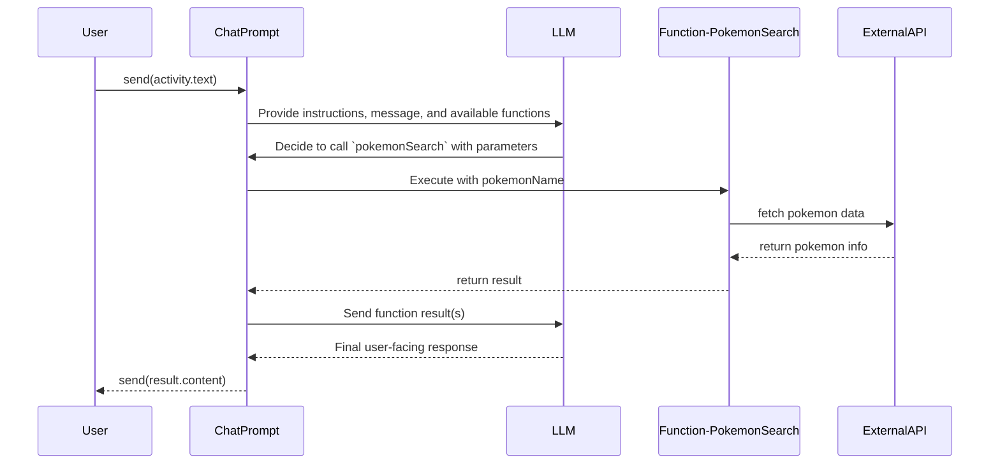

```typescript

// ...

const prompt = new ChatPrompt({
  instructions: 'You are a helpful assistant that can look up Pokemon for the user.',
  model,
})
  // Include `function` as part of the prompt
  .function(
    'pokemonSearch',
    'search for pokemon',
    // Include the schema of the parameters
    // the LLM needs to return to call the function
    {
      type: 'object',
      properties: {
        pokemonName: {
          type: 'string',
          description: 'the name of the pokemon',
        },
      },
      required: ['text'],
    },
    // The cooresponding function will be called
    // automatically if the LLM decides to call this function
    async ({ pokemonName }: IPokemonSearch) => {
      log.info('Searching for pokemon', pokemonName);
      const response = await fetch(`https://pokeapi.co/api/v2/pokemon/${pokemonName}`);
      if (!response.ok) {
        throw new Error('Pokemon not found');
      }
      const data = await response.json();
      // The result of the function call is sent back to the LLM
      return {
        name: data.name,
        height: data.height,
        weight: data.weight,
        types: data.types.map((type: { type: { name: string } }) => type.type.name),
      };
    }
  );

// The LLM will then produce a final response to be sent back to the user
// activity.text could have text like 'pikachu'
const result = await prompt.send(activity.text);
await send(result.content ?? 'Sorry I could not find that pokemon');
```

## Multiple functions

Additionally, for complex scenarios, you can add multiple functions to the `ChatPrompt`. The LLM will then decide which function to call based on the context of the conversation. The LLM can pick one or more functions to call before returning the final response.

```typescript

// ...

// activity.text could be something like "what's my weather?"
// The LLM will need to first figure out the user's location
// Then pass that in to the weatherSearch
const prompt = new ChatPrompt({
  instructions: 'You are a helpful assistant that can help the user get the weather',
  model,
})
  // Include multiple `function`s as part of the prompt
  .function(
    'getUserLocation',
    'gets the location of the user',
    // This function doesn't need any parameters,
    // so we do not need to provide a schema
    async () => {
      const locations = ['Seattle', 'San Francisco', 'New York'];
      const randomIndex = Math.floor(Math.random() * locations.length);
      const location = locations[randomIndex];
      log.info('Found user location', location);
      return location;
    }
  )
  .function(
    'weatherSearch',
    'search for weather',
    {
      type: 'object',
      properties: {
        location: {
          type: 'string',
          description: 'the name of the location',
        },
      },
      required: ['location'],
    },
    async ({ location }: { location: string }) => {
      const weatherByLocation: Record<string, {}> = {
        Seattle: { temperature: 65, condition: 'sunny' },
        'San Francisco': { temperature: 60, condition: 'foggy' },
        'New York': { temperature: 75, condition: 'rainy' },
      };

      const weather = weatherByLocation[location];
      if (!weather) {
        return 'Sorry, I could not find the weather for that location';
      }

      log.info('Found weather', weather);
      return weather;
    }
  );

// The LLM will then produce a final response to be sent back to the user
const result = await prompt.send(activity.text);
await send(result.content ?? 'Sorry I could not figure it out');
```

## Stopping Functions early

You'll notice that after the function responds, `ChatPrompt` re-sends the response from the function invocation back to the LLM which responds back with the user-facing message. It's possible to prevent this "automatic" function calling by passing in a flag

```typescript

// ...

const result = await prompt.send(activity.text, {
  autoFunctionCalling: false, // Disable automatic function calling
});
// Extract the function call arguments from the result
const functionCallArgs = result.function_calls?.[0].arguments;

const firstCall = result.function_calls?.[0];
const fnResult = actualFunction(firstCall.arguments);
messages.push({
  role: 'function',
  function_id: firstCall.id,
  content: fnResult,
});

// Optionally, you can call the chat prompt again after updating the messages with the results
const result = await prompt.send('What should we do next?', {
  messages,
  autoFunctionCalling: true, // You can enable it here if you want
});
const functionCallArgs = result.function_calls?.[0].arguments; // Extract the function call arguments
await send(
  `The LLM responed with the following structured output: ${JSON.stringify(functionCallArgs, undefined, 2)}.`
);
```

---

### Handling Multi-Step Forms

# Handling Multi-Step Forms

Dialogs can become complex yet powerful with multi-step forms. These forms can alter the flow of the survey depending on the user's input or customize subsequent steps based on previous answers.

Start by returning the first step's card from the `dialog.open` handler.

```typescript

// ...

app.on('dialog.open.multi_step_form', async () => {
  const dialogCard = new AdaptiveCard(
    {
      type: 'TextBlock',
      text: 'This is a multi-step form',
      size: 'Large',
      weight: 'Bolder',
    },
    new TextInput()
      .withLabel('Name')
      .withIsRequired()
      .withId('name')
      .withPlaceholder('Enter your name')
  ).withActions(
    // Route to a step-specific submit handler
    new SubmitAction()
      .withTitle('Submit')
      .withData(new SubmitData('multi_step_1'))
  );

  return {
    task: {
      type: 'continue',
      value: {
        title: 'Multi-step Form Dialog',
        card: cardAttachment('adaptive', dialogCard),
      },
    },
  };
});
```

Then in the submission handler, return `type: 'continue'` with the next card to keep the dialog open. Pass state forward using `SubmitData`'s extra data parameter.

```typescript

// ...

// Step 1 submit — show step 2
app.on('dialog.submit.multi_step_1', async ({ activity }) => {
  const name = activity.value.data.name;
  const nextStepCard = new AdaptiveCard(
    {
      type: 'TextBlock',
      text: 'Email',
      size: 'Large',
      weight: 'Bolder',
    },
    new TextInput()
      .withLabel('Email')
      .withIsRequired()
      .withId('email')
      .withPlaceholder('Enter your email')
  ).withActions(
    new SubmitAction().withTitle('Submit').withData(
      // Carry forward data from step 1 via extra data
      new SubmitData('multi_step_2', { name })
    )
  );

  return {
    task: {
      type: 'continue',
      value: {
        title: `Thanks ${name} - Get Email`,
        card: cardAttachment('adaptive', nextStepCard),
      },
    },
  };
});

// Step 2 submit — final step, close the dialog
app.on('dialog.submit.multi_step_2', async ({ activity, send }) => {
  const name = activity.value.data.name;
  const email = activity.value.data.email;
  await send(`Hi ${name}, thanks for submitting the form! We got that your email is ${email}`);
  return { status: 200 };
});
```

---

### In-Depth Guides

# In-Depth Guides

This documentation covers advanced features and capabilities of the Teams SDK in TypeScript.

This section provides comprehensive technical guides for integration with useful Teams features. Learn how to implement AI-powered bots, create adaptive cards, manage authentication flows, and build sophisticated message extensions. Each guide includes practical examples and best practices for production applications.

---

### 🔒 User Authentication

# 🔒 User Authentication

At times agents must access secured online resources on behalf of the user, such as checking email, checking on flight status, or placing an order. To enable this, the user must authenticate their identity and grant consent for the application to access these resources. This process results in the application receiving a token, which the application can then use to access the permitted resources on the user's behalf.

:::info
This is an advanced guide. It is highly recommended that you are familiar with [Teams Core Concepts](/teams/core-concepts) before attempting this guide.
:::

:::warning
User authentication does not work with the developer tools setup. You have to run the app in Teams. Follow [Quickstart: Register your app](/get-started/quickstart-register) to register and sideload your bot.
:::

:::info
It is possible to authenticate the user into [other auth providers](https://learn.microsoft.com/en-us/azure/bot-service/bot-builder-concept-identity-providers?view=azure-bot-service-4.0&tabs=adv2%2Cga2#other-identity-providers) like Facebook, Github, Google, Dropbox, and so on.
:::

Once you have configured your Azure Bot resource OAuth settings, as described in the [official documentation](https://learn.microsoft.com/en-us/azure/bot-service/bot-builder-concept-authentication?view=azure-bot-service-4.0), add the following code to your `App`:

## Project Setup

### Create an app with the `graph` template

:::tip
Skip this step if you want to add the auth configurations to an existing app.
:::

Use your terminal to run the following command:

```sh
teams project new typescript oauth-app --template graph
```

This command:

1. Creates a new directory called `oauth-app`.
2. Bootstraps the graph agent template files into it under `oauth-app/src`.
3. Creates your agent's manifest files, including a `manifest.json` file and placeholder icons in the `oauth-app/appPackage` directory.

### Set up the OAuth connection

User authentication requires an **Azure-managed bot** (Teams-managed bots don't support OAuth connections). If you registered with `--teams-managed`, migrate first:

```sh
teams app bot migrate <appId> --subscription <id> --resource-group <your-resource-group>
```

Then follow the [User Authentication Setup guide](/cli/guides/user-authentication-setup) to configure the AAD app, create the Azure Bot OAuth connection, and update the manifest. The guide covers both SSO (silent token exchange) and generic OAuth.

:::tip
If you'd rather have an AI coding assistant run the setup, install the [`teams-dev` skill](/developer-tools/agent-skills) and ask it to "set up SSO for my Teams bot".
:::

## Configure the OAuth connection

```ts

const app = new App({
  oauth: {
    defaultConnectionName: 'graph',
  },
});
```

:::tip
Make sure you use the same name you used when creating the OAuth connection in the Azure Bot Service resource.
:::

:::note
In many templates, `graph` is the default name of the OAuth connection, but you can change that by supplying a different connection name in your app configuration.
:::

## Signing In

:::note
This uses the Single Sign-On (SSO) authentication flow. To learn more about all the available flows and their differences see the [official documentation](https://learn.microsoft.com/en-us/azure/bot-service/bot-builder-concept-authentication?view=azure-bot-service-4.0).
:::

You must call the `signin` method inside your route handler, for example: to signin when receiving the `/signin` message:

```ts
app.message('/signin', async ({ signin, send }) => {
  if (await signin()) {
    await send('you are already signed in!');
  }
});
```

## Subscribe to the SignIn event

You can subscribe to the `signin` event, that will be triggered once the OAuth flow completes.

```ts
app.event('signin', async ({ send, token }) => {
  await send(
    `Signed in using OAuth connection ${token.connectionName}. Please type **/whoami** to see your profile or **/signout** to sign out.`
  );
});
```

## Start using the graph client

From this point, you can use the `IsSignedIn` flag and the `userGraph` client to query graph, for example to reply to the `/whoami` message, or in any other route.

:::note
The default OAuth configuration requests the `User.ReadBasic.All` permission. It is possible to request other permissions by modifying the App Registration for the bot on Azure.
:::

```ts

app.message('/whoami', async ({ send, userGraph, signin }) => {
  if (!await signin()) {
    return;
  }
  const me = await userGraph.call(endpoints.me.get);
  await send(
    `you are signed in as "${me.displayName}" and your email is "${me.mail || me.userPrincipalName}"`
  );
});

app.on('message', async ({ send, activity, signin }) => {
  if (await signin()) {
    await send(
      `You said: "${activity.text}". Please type **/whoami** to see your profile or **/signout** to sign out.`
    );
  } else {
    await send(`You said: "${activity.text}". Please type **/signin** to sign in.`);
  }
});
```

## Signing Out

You can signout by calling the `signout` method, this will remove the token from the User Token service cache

```ts
app.message('/signout', async ({ send, signout, isSignedIn }) => {
  if (!isSignedIn) return;
  await signout();
  await send('you have been signed out!');
});
```

## Handling Sign-In Failures

When using SSO, if the token exchange fails Teams sends a `signin/failure` invoke activity to your app. The SDK includes a built-in default handler that logs a warning with actionable troubleshooting guidance. You can optionally register your own handler to customize the behavior:

```ts
app.on('signin.failure', async ({ activity, send }) => {
  const { code, message } = activity.value;
  console.log(`Sign-in failed: ${code} - ${message}`);
  await send('Sign-in failed.');
});
```

:::tip
The most common failure codes are `installedappnotfound` (bot app not installed for the user) and `resourcematchfailed` (Token Exchange URL doesn't match the Application ID URI). See [SSO Setup - Troubleshooting](/teams/user-authentication/sso-setup#troubleshooting) for a full list of failure codes and troubleshooting steps.
:::

## Regional Configs
You may be building a regional bot that is deployed in a specific Azure region (such as West Europe, East US, etc.) rather than global. This is important for organizations that have data residency requirements or want to reduce latency by keeping data and authentication flows within a specific area.

These examples use West Europe, but follow the equivalent for other regions.

**Azure Portal:**

To configure a new regional bot in Azure, you must setup your resoures in the desired region. Your resource group must also be in the same region. 

1. Deploy a new App Registration in `westeurope`.
2. Deploy and link a new Enterprise Application (Service Principal) on Microsoft Entra in `westeurope`.
3. Deploy and link a new Azure Bot in `westeurope`.
4. In your App Registration, in the `Authentication (Preview)` tab, add a `Redirect URI` for the Platform Type `Web` to your regional endpoint (e.g., `https://europe.token.botframework.com/.auth/web/redirect`)


5. In your `.env` file (or wherever you set your environment variables), add your `OAUTH_URL`. For example:
`OAUTH_URL=https://europe.token.botframework.com`

**Agents Toolkit:**

To configure a new regional bot with ATK, you will need to make a few updates. Note that this assumes you have not yet deployed the bot previously.

1. In `azurebot.bicep`, replace all `global` occurrences to `westeurope`
2. In `manifest.json`, in `validDomains`, `*.botframework.com` should be replaced by `europe.token.botframework.com`
3. In `aad.manifest.json`, replace `https://token.botframework.com/.auth/web/redirect` with `https://europe.token.botframework.com/.auth/web/redirect`
4. In your `.env` file, add your `OAUTH_URL`. For example:
`OAUTH_URL=https://europe.token.botframework.com`

## Resources

[User Authentication Basics](https://learn.microsoft.com/en-us/azure/bot-service/bot-builder-concept-authentication?view=azure-bot-service-4.0)

---

### 🔗 Link unfurling

# 🔗 Link unfurling

Link unfurling lets your app respond when users paste URLs into Teams. When a URL from your registered domain is pasted, your app receives the URL and can return a card with additional information or actions. This works like a search command where the URL acts as the search term.

:::note
Users can use link unfurling even before they discover or install your app in Teams. This is called [Zero install link unfurling](https://learn.microsoft.com/en-us/microsoftteams/platform/messaging-extensions/how-to/link-unfurling?tabs=desktop%2Cjson%2Cadvantages#zero-install-for-link-unfurling). In this scenario, your app will receive a `message.ext.anon-query-link` activity instead of the usual `message.ext.query-link`.
:::

## Setting up your Teams app manifest

### Configure message handlers

```json
"composeExtensions": [
    {
        "botId": "${{BOT_ID}}",
        "messageHandlers": [
            {
                "type": "link",
                "value": {
                    "domains": [
                        "www.test.com"
                    ]
                }
            }
        ]
    }
]
```

### How link unfurling works

When a user pastes a URL from your registered domain (like `www.test.com`) into the Teams compose box, your app will receive a notification. Your app can then respond by returning an adaptive card that displays a preview of the linked content. This preview card appears before the user sends their message in the compose box, allowing them to see how the link will be displayed to others.

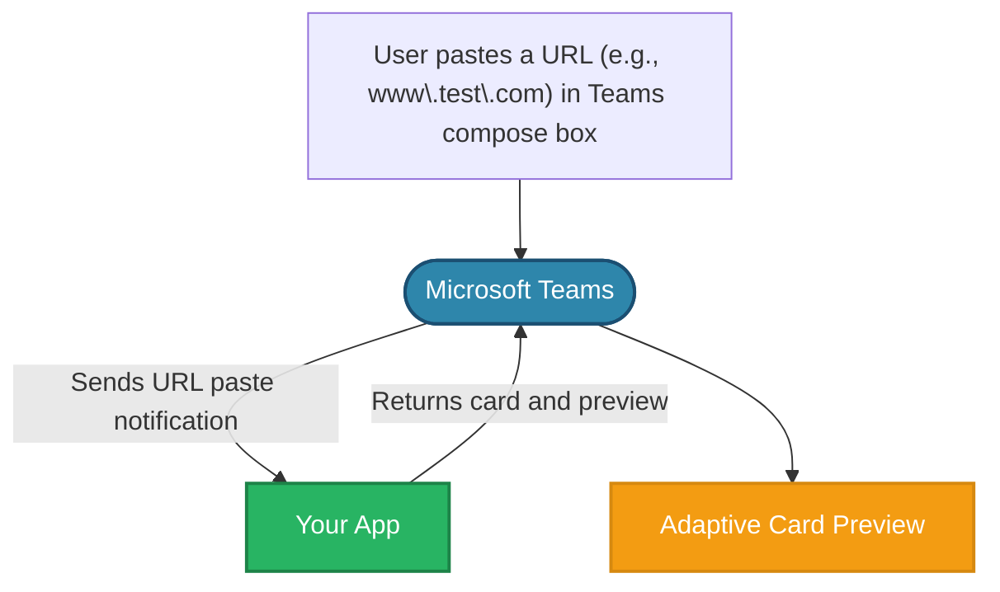

## Implementing link unfurling

### Handle the query link event

Handle link unfurling when a URL from your registered domain is submitted into the Teams compose box.

```typescript

// ...

app.on('message.ext.query-link', async ({ activity }) => {
  const { url } = activity.value;

  if (!url) {
    return { status: 400 };
  }

  const { card, thumbnail } = createLinkUnfurlCard(url);
  const attachment = {
    ...cardAttachment('adaptive', card), // expanded card in the compose box...
    preview: cardAttachment('thumbnail', thumbnail), //preview card in the compose box...
  };

  return {
    composeExtension: {
      type: 'result',
      attachmentLayout: 'list',
      attachments: [attachment],
    },
  };
});
```

### Create the unfurl card

`createLinkUnfurlCard()` function

```typescript

// ...

export function createLinkUnfurlCard(url: string) {
  const thumbnail = {
    title: 'Unfurled Link',
    text: url,
    images: [
      {
        url: IMAGE_URL,
      },
    ],
  } as ThumbnailCard;

  const card = new AdaptiveCard(
    new TextBlock('Unfurled Link', {
      size: 'Large',
      weight: 'Bolder',
      color: 'Accent',
      style: 'heading',
    }),
    new TextBlock(url, {
      size: 'Small',
      weight: 'Lighter',
      color: 'Good',
    })
  );

  return {
    card,
    thumbnail,
  };
}
```

### User experience flow

The link unfurling response includes both a full adaptive card and a preview card. The preview card appears in the compose box when a user pastes a URL:


The user can expand the preview card by clicking on the _expand_ button on the top right.


The user can then choose to send either the preview or the full adaptive card as a message.

## Resources

- [Link unfurling](https://learn.microsoft.com/en-us/microsoftteams/platform/messaging-extensions/how-to/link-unfurling?tabs=desktop%2Cjson%2Cadvantages)
- [Zero install link unfurling](https://learn.microsoft.com/en-us/microsoftteams/platform/messaging-extensions/how-to/link-unfurling?tabs=desktop%2Cjson%2Cadvantages#zero-install-for-link-unfurling)

---

### Keeping State

# Keeping State

By default, LLMs are not stateful. This means that they do not remember previous messages or context when generating a response.
It's common practice to keep state of the conversation history in your application and pass it to the LLM each time you make a request.

By default, the `ChatPrompt` instance will create a temporary in-memory store to keep track of the conversation history. This is beneficial
when you want to use it to generate an LLM response, but not persist the conversation history. But in other cases, you may want to keep the conversation history

:::warning
By reusing the same `ChatPrompt` class instance across multiple conversations will lead to the conversation history being shared across all conversations. Which is usually not the desired behavior.
:::

To avoid this, you need to get messages from your persistent (or in-memory) store and pass it in to the `ChatPrompt`.

:::note
The `ChatPrompt` class will modify the messages object that's passed into it. So if you want to manually manage it, you need to make a copy of the messages object before passing it in.
:::

## State Initialization

Here's how to initialize and manage conversation state for multiple conversations:

```typescript

// ...

// Simple in-memory store for conversation histories
// In your application, it may be a good idea to use a more
// persistent store backed by a database or other storage solution
const conversationStore = new Map<string, Message[]>();

const getOrCreateConversationHistory = (conversationId: string) => {
  // Check if conversation history exists
  const existingMessages = conversationStore.get(conversationId);
  if (existingMessages) {
    return existingMessages;
  }
  // If not, create a new conversation history
  const newMessages: Message[] = [];
  conversationStore.set(conversationId, newMessages);
  return newMessages;
};
```

## Usage Example

```typescript
/**
 * Example of a stateful conversation handler that maintains conversation history
 * using an in-memory store keyed by conversation ID.
 * @param model The chat model to use
 * @param activity The incoming activity
 * @param send Function to send an activity
 */
export const handleStatefulConversation = async (
  model: IChatModel,
  activity: IMessageActivity,
  send: (activity: ActivityLike) => Promise<any>,
  log: ILogger
) => {
  log.info('Received message', activity.text);

  // Retrieve existing conversation history or initialize new one
  const existingMessages = getOrCreateConversationHistory(activity.conversation.id);

  log.info('Existing messages before sending to prompt', existingMessages);

  // Create prompt with existing messages
  const prompt = new ChatPrompt({
    instructions: 'You are a helpful assistant.',
    model,
    messages: existingMessages, // Pass in existing conversation history
  });

  const result = await prompt.send(activity.text);

  if (result) {
    await send(
      result.content != null
        ? new MessageActivity(result.content).addAiGenerated()
        : 'I did not generate a response.'
    );
  }

  log.info('Messages after sending to prompt:', existingMessages);
};
```


---

### Microsoft Graph Client

# Microsoft Graph Client

The client App exposes a `graph` property that gives type-safe access to Microsoft Graph functions. When graph functions are invoked, the app attaches an MSAL bearer token to the request so that the call can be authenticated and authorized.

## Invoking Graph functions

After constructing and starting an App instance, you can invoke any graph function by using the `app.graph` client.

```typescript

const app = new App(clientId);
await app.start();

const top10Chats = await app.graph.call(endpoints.chats.list, { $top: 10 });
```

For best result, it's wise to ensure that the user has consented to a permission required by the graph API before attempting to invoke it. Otherwise, the call is likely to be rejected by the graph server.

## Graph APIs and permissions

Different graph APIs have different permission requirements. The app developer should make sure that consent is granted before invoking a graph API. To help request and test for consent, the client App offers three methods:

- Pre-warming while starting the app.
- Requesting consent if not already granted.
- Testing for consent without prompting.

### Pre-warming while starting the app

The App constructor takes an option that lets you control how scope consent is requested while starting the app. For more details on this option, see the [App options](./app-options) documentation.

### Requesting consent if not already granted

The app provides an `ensureConsentForScopes` method that tests if the user has consented to a certain set of scopes and prompts them if consent isn't yet granted.

The method returns a promise that resolves to true if the user has already provided consent to all listed scopes; and to false if the user declines the prompt.

This method is useful for building an incremental, just-in-time, consent model, or to fully control how consent is pre-warmed.

```typescript

const app = new App(clientId, {
  msalOptions: { prewarmScopes: ['User.Read'] },
});

// this will prompt for the User.Read scope if not already granted
await app.start();

// this will prompt for Chat.ReadBasic if not already granted
const canReadChat = await app.ensureConsentForScopes(['Chat.ReadBasic']);

if (canReadChat) {
  const top10Chats = await app.graph.call(endpoints.chats.list, { $top: 10 });
  // ... do something useful ...
}
```

#### Testing for consent without prompting

The app also provides a `hasConsentForScopes` method to test for consent without raising a prompt. This is handy to enable or disable features based on user choice, or to provide friendly messaging before raising a prompt with `ensureConsentForScopes`.

```typescript

const app = new App(clientId);

// this will prompt for the '.default' scope if the user hasn't already
// consented to any scope
await app.start();

// this will not raise a prompt under any circumstance
const canReadChat = await app.hasConsentForScopes(['Chat.ReadBasic']);

if (canReadChat) {
  const top10Chats = await app.graph.call(endpoints.chats.list, { $top: 10 });
  // ... do something useful ...
}
```

## References

- [Graph API overview](https://learn.microsoft.com/en-us/graph/api/overview)
- [Graph API permissions overview](https://learn.microsoft.com/en-us/graph/permissions-reference)

---

### Sending Messages

# Sending Messages

Sending messages is a core part of an agent's functionality. With all activity handlers, a `send` method is provided which allows your handlers to send a message back to the user to the relevant conversation.

```typescript
app.on('message', async ({ activity, send }) => {
  await send(`You said: ${activity.text}`);
});
```

In the above example, the handler gets a `message` activity, and uses the `send` method to send a reply to the user.

```typescript
app.on('signin.verify-state', async ({ send }) => {
  await send('You have successfully signed in!');
});
```

You are not restricted to only replying to `message` activities. In the above example, the handler is listening to `signin.verify-state` events, which are sent when a user successfully signs in.

:::tip
This shows an example of sending a text message. Additionally, you are able to send back things like [adaptive cards](../../in-depth-guides/adaptive-cards) by using the same `send` method. Look at the [adaptive card](../../in-depth-guides/adaptive-cards) section for more details.
:::

## Streaming

You may also stream messages to the user which can be useful for long messages, or AI generated messages. The SDK makes this simple for you by providing a `stream` function which you can use to send messages in chunks.

```typescript
app.on('message', async ({ activity, stream }) => {
  stream.emit('hello');
  stream.emit(', ');
  stream.emit('world!');

  // result message: "hello, world!"
});
```

:::note
Streaming is currently only supported in 1:1 conversations, not group chats or channels
:::


## @Mention

Sending a message at `@mentions` a user is as simple including the details of the user using the `addMention` method

```typescript
app.on('message', async ({ send, activity }) => {
  await send(new MessageActivity('hi!').addMention(activity.from));
});
```

## Targeted Messages

:::info[Coming Soon]
Targeted messages are coming soon in May 2026.
:::

Targeted messages, also known as ephemeral messages, are delivered to a specific user in a shared conversation. From a single user's perspective, they appear as regular inline messages in a conversation. Other participants won't see these messages, making them useful for authentication flows, help or error responses, personal reminders, or sharing contextual information without cluttering the group conversation.

To send a targeted message when responding to an incoming activity, use the `withRecipient` method with the recipient account and set the targeting flag to true.

```typescript

app.on('message', async ({ send, activity }) => {
  // Using withRecipient with isTargeted=true explicitly targets the specified recipient
  await send(
    new MessageActivity('This message is only visible to you!')
      .withRecipient(activity.from, true)
  );
});
```

## Reactions

:::info[Coming Soon]
Reactions are coming soon in May 2026.
:::

Reactions allow your agent to add or remove emoji reactions on messages in a conversation. The reactions client is available via the API client.

## Threading

In Teams channels, messages can be organized into threads. The SDK provides helpers to simplify working with threads.

### Reactive Threading (Within a Handler)

When your agent receives a message in a thread, the conversation context already carries the thread ID. Use `send()` to send a message in the same thread without quoting, or `reply()` to send with a visual quote of the inbound message.

```typescript
app.on('message', async ({ send, reply }) => {
  // Send in the same thread, no quote
  await send('Acknowledged');

  // Send in the same thread with a visual quote of the inbound message
  await reply('Got it!');
});
```

For proactive threading (sending to a thread outside of a handler), see [Proactive Messaging](./proactive-messaging#proactive-threading).

---

### 🤖 AI

# 🤖 AI

The AI packages in this SDK are designed to make it easier to build applications with LLMs.
The `@microsoft/teams.ai` package has two main components:

## 📦 Prompts

A `Prompt` is the component that orchestrates everything, it handles state management,
function definitions, and invokes the model/template when needed. This layer abstracts many of
the complexities of the Models to provide a common interface.

## 🧠 Models

A `Model` is the component that interfaces with the LLM, being given some `input` and returning the `output`.
This layer deals with any of the nuances of the particular Models being used.

It is in the model implementation that the individual LLM features (i.e. streaming/tools etc.)
are made compatible with the more general features of the `@microsoft/teams.ai` package.

:::note
You are not restricted to use the `@microsoft/teams.ai` package to build your Teams Agent applications. You can use models directly if you choose. These packages are there to simplify the interactions with the models and Teams.
:::

---

### App Authentication

# App Authentication

Your application needs to authenticate to send messages to Teams as your bot. Authentication allows your app service to certify that it is _allowed_ to send messages as your Azure Bot.

:::info Azure Setup Required
Before configuring your application, you must first set up authentication in Azure. See the [App Authentication Setup](/teams/app-authentication) guide for instructions on creating the necessary Azure resources.
:::

## Authentication Methods

There are 3 main ways of authenticating:

1. **Client Secret** - Simple password-based authentication using a client secret
2. **User Managed Identity** - Passwordless authentication using Azure managed identities
3. **Federated Identity Credentials** - Advanced identity federation using managed identities

## Configuration Reference

The Teams SDK automatically detects which authentication method to use based on the environment variables you set:

| CLIENT_ID | CLIENT_SECRET | MANAGED_IDENTITY_CLIENT_ID | Authentication Method |
|-|-|-|-|
| not_set | | | No-Auth (local development only) |
| set | set | | Client Secret |
| set | not_set | | User Managed Identity |
| set | not_set | set (same as CLIENT_ID) | User Managed Identity |
| set | not_set | set (different from CLIENT_ID) | Federated Identity Credentials (UMI) |
| set | not_set | "system" | Federated Identity Credentials (System Identity) |

## Client Secret

The simplest authentication method using a password-like secret.

### Setup

First, complete the [Client Secret Setup](/teams/app-authentication/client-secret) in Azure Portal or Azure CLI.

### Configuration

Set the following environment variables in your application:

- `CLIENT_ID`: Your Application (client) ID
- `CLIENT_SECRET`: The client secret value you created
- `TENANT_ID`: The tenant id where your bot is registered

```env
CLIENT_ID=your-client-id-here
CLIENT_SECRET=your-client-secret-here
TENANT_ID=your-tenant-id
```

The SDK will automatically use Client Secret authentication when both `CLIENT_ID` and `CLIENT_SECRET` are provided.

## User Managed Identity

Passwordless authentication using Azure managed identities - no secrets to rotate or manage.

### Setup

First, complete the [User Managed Identity Setup](/teams/app-authentication/user-managed-identity) in Azure Portal or Azure CLI.

### Configuration

Your application should automatically use User Managed Identity authentication when you provide the `CLIENT_ID` environment variable without a `CLIENT_SECRET`.

## Configuration

Set the following environment variables in your application:

- `CLIENT_ID`: Your Application (client) ID
- **Do not set** `CLIENT_SECRET`
- `TENANT_ID`: The tenant id where your bot is registered

```env
CLIENT_ID=your-client-id-here
# Do not set CLIENT_SECRET
TENANT_ID=your-tenant-id
```

## Federated Identity Credentials

Advanced identity federation allowing you to assign managed identities directly to your App Registration.

### Setup

First, complete the [Federated Identity Credentials Setup](/teams/app-authentication/federated-identity-credentials) in Azure Portal or Azure CLI.

### Configuration

Depending on the type of managed identity you select, set the environment variables accordingly.

**For User Managed Identity:**

Set the following environment variables:
- `CLIENT_ID`: Your Application (client) ID
- `MANAGED_IDENTITY_CLIENT_ID`: The Client ID for the User Managed Identity resource
- **Do not set** `CLIENT_SECRET`
- `TENANT_ID`: The tenant id where your bot is registered

```env
CLIENT_ID=your-app-client-id-here
MANAGED_IDENTITY_CLIENT_ID=your-managed-identity-client-id-here
# Do not set CLIENT_SECRET
TENANT_ID=your-tenant-id
```

**For System Assigned Identity:**

Set the following environment variables:
- `CLIENT_ID`: Your Application (client) ID
- `MANAGED_IDENTITY_CLIENT_ID`: `system`
- **Do not set** `CLIENT_SECRET`
- `TENANT_ID`: The tenant id where your bot is registered

```env
CLIENT_ID=your-app-client-id-here
MANAGED_IDENTITY_CLIENT_ID=system
# Do not set CLIENT_SECRET
TENANT_ID=your-tenant-id
```

## Sovereign Cloud

If your bot runs in a US Government (GCC-High, DoD) or China (21Vianet) cloud environment, add the `CLOUD` environment variable to your configuration:

```env
CLOUD=USGov
```

Valid values: `Public` (default), `USGov`, `USGovDoD`, `China`

The SDK automatically configures all authentication endpoints for the specified cloud. No other changes are needed. See the Sovereign Cloud guide for details and programmatic configuration options.

## Troubleshooting

If you encounter authentication errors, see the [Authentication Troubleshooting](/teams/app-authentication/troubleshooting) guide for common issues and solutions.

---

### Best Practices

# Best Practices

When sending messages using AI, Teams recommends a number of best practices to help with both user and developer experience.

## AI-Generated Indicator

When sending messages using AI, Teams recommends including an indicator that the message was generated by AI. This can be done by adding a `addAiGenerated` property to outgoing message. This will help users understand that the message was generated by AI, and not by a human and can help with trust and transparency.

```typescript
const messageToBeSent = new MessageActivity('Hello!').addAiGenerated();
```


## Gather feedback to improve prompts

AI Generated messages are not always perfect. Prompts can have gaps, and can sometimes lead to unexpected results. To help improve the prompts, Teams recommends gathering feedback from users on the AI-generated messages. See [Feedback](../feedback) for more information on how to gather feedback.

This does involve thinking through a pipeline for gathering feedback and then automatically, or manually, updating prompts based on the feedback. The feedback system is an point of entry to your eval pipeline.

## Citations

AI generated messages can hallucinate even if messages are grounded in real data. To help with this, Teams recommends including citations in the AI Generated messages. This is easy to do by simply using the `addCitations` method on the message. This will add a citation to the message, and the LLM will be able to use it to generate a citation for the user.

:::warning
Citations are added with a `position` property. This property value needs to also be included in the message text as `[<position>]`. If there is a citation that's added without the associated value in the message text, Teams will not render the citation
:::

```typescript

// ...

const messageActivity = new MessageActivity(result.content).addAiGenerated();
for (let i = 0; i < citedDocs.length; i++) {
  const doc = citedDocs[i];
  // The corresponding citation needs to be added in the message content
  messageActivity.text += `[${i + 1}]`;
  messageActivity.addCitation(i + 1, {
    name: doc.title,
    abstract: doc.content,
  });
}
```


## Suggested actions

Suggested actions help users with ideas of what to ask next, based on the previous response or conversation. Teams recommends including suggested actions in your messages. You can do that by using the `withSuggestedActions` method on the message. See [Suggested actions](https://learn.microsoft.com/microsoftteams/platform/bots/how-to/conversations/prompt-suggestions) for more information on suggested actions.

```typescript
message.withSuggestedActions({
  to: [activity.from.id],
  actions: [
    {
      type: 'imBack',
      title: 'Show pricing options',
      value: 'Show the pricing options available to me',
    },
  ],
});
```

---

### Functions

# Functions

Agents may want to expose REST APIs that client applications can call. This SDK makes it easy to implement those APIs through the `app.function()` method. The function takes a name and a callback that implements the function.

```typescript
app.function('do-something', () => {
  // do something useful
});
```

This registers a REST API hosted at `http://localhost:PORT/api/functions/do-something` or `https://BOT_DOMAIN/api/functions/do-something` that clients can POST to. When they do, this SDK validates that the caller provides a valid Microsoft Entra bearer token before invoking the registered callback. If the token is missing or invalid, the request is denied with a HTTP 401.

The function can be typed to accept input arguments. The clients would include those in the POST request payload, and they are made available in the callback through the `data` context argument.

```typescript
app.function<{}, { message: string }>('process-message', ({ data, log }) => {
  log.info(`process-message called with: ${data.message}`);
});
```

:::warning
This SDK does not validate that the function arguments are of the expected types or otherwise trustworthy. You must take care to validate the input arguments before using them.
:::

If desired, the function can return data to the caller. The return value can be a string, an object, or an array.

```typescript
app.function('get-random-number', () => {
  return '4'; // chosen by fair dice roll;
  // guaranteed to be random
});
```

If your function returns a number, that will be interpreted as an HTTP status code:

```typescript
app.function('privileged-action', ({ userId }) => {
  if (!hasPermission(userId)) {
    return 401; // HTTP response will have status 401: unauthorized
  }
  // ... do something
});
```

## Function context

The function callback receives a context object with a number of useful values. Some originate within the agent itself, while others are furnished by the caller via the HTTP Request.

| Property                   | Source | Description                                                                                                                               |
| -------------------------- | ------ | ----------------------------------------------------------------------------------------------------------------------------------------- |
| `api`                      | Agent  | The API client.                                                                                                                           |
| `appGraph`                 | Agent  | The app graph client.                                                                                                                     |
| `appId`                    | Agent  | Unique identifier assigned to the app after deployment, ensuring correct app instance recognition across hosts.                           |
| `appSessionId`             | Caller | Unique ID for the calling app's session, used to correlate telemetry data.                                                                |
| `authToken`                | Caller | The validated MSAL Entra token.                                                                                                           |
| `channelId`                | Caller | Microsoft Teams ID for the channel associated with the content.                                                                           |
| `chatId`                   | Caller | Microsoft Teams ID for the chat associated with the content.                                                                              |
| `data`                     | Caller | The function payload.                                                                                                                     |
| `getCurrentConversationId` | Agent  | Attempts to find the conversation ID where the app is used and verifies agent-user presence. Returns `undefined` if not found or invalid. |
| `log`                      | Agent  | The app logger instance.                                                                                                                  |
| `meetingId`                | Caller | Meeting ID used by tab when running in meeting context.                                                                                   |
| `messageId`                | Caller | ID of the parent message from which the task module was launched (only available in bot card-launched modules).                           |
| `pageId`                   | Caller | Developer-defined unique ID for the page this content points to.                                                                          |
| `send`                     | Agent  | Sends an activity to the current conversation. Returns `null` if the conversation ID is invalid or undetermined.                          |
| `subPageId`                | Caller | Developer-defined unique ID for the sub-page this content points to. Used to restore specific state within a page.                        |
| `teamId`                   | Caller | Microsoft Teams ID for the team associated with the content.                                                                              |
| `tenantId`                 | Caller | Microsoft Entra tenant ID of the current user, extracted from the validated auth token.                                                   |
| `userId`                   | Caller | Microsoft Entra object ID of the current user, extracted from the validated auth token.                                                   |

The `authToken` is validated before the function callback is invoked, and the `tenantId` and `userId` values are extracted from the validated token. In the typical case, the remaining caller-supplied values would reflect what the Teams Tab app retrieves from the teams-js `getContext()` API, but the agent does not validate them.

:::warning
Take care to validate the caller-supplied values before using them. Don't assume that the calling user actually has access to items indicated in the context.
:::

To simplify two common scenarios, the context provides the `getCurrentConversationId` and `send` methods.

- The `getCurrentConversationId` method attempts to find the current conversation ID based on the context provided by the client (chatId and channelId) and validates that both the agent and the calling user are actually present in the conversation. If neither chatId or channelId is provided by the caller, the ID of the 1:1 conversation between the agent and the user is returned.
- The `send` method relies on `getCurrentConversationId` to find the conversation where the app is hosted and posts an activity.

## Additional resources

- For details on how to Tab apps can invoke these functions, see the [Executing Functions](./function-calling) in-depth guide.

---

### MCP

# MCP

Teams SDK has optional packages which support the [Model Context Protocol (MCP)](https://modelcontextprotocol.io/introduction) as a service or client. This allows you to use MCP to call functions and tools in your application.

MCP servers and MCP clients dynamically load function definitions and tools.

When building Servers, this could mean that you can introduce new tools as part of your application, and the MCP clients that are connected to it will automatically start consuming those tools.

When building Clients, this could mean that you can connect to other MCP servers and your application has the flexibility to improve as the MCP servers its connected to evolve over time.

:::tip
The guides here can be used to build a server and a client that can leverage each other. That means you can build a server that has the ability to do complex things for the client agent.
:::

---

### Tabs

# Tabs

Tabs are host-aware webpages embedded in Microsoft Teams, Outlook, and Microsoft 365. Tabs are commonly implemented as Single Page Applications that use the Teams [JavaScript client library](https://learn.microsoft.com/en-us/microsoftteams/platform/tabs/how-to/using-teams-client-library) (TeamsJS) to interact with the app host.

Tab apps will often need to interact with remote services. They may need to fetch data from [Microsoft Graph](https://learn.microsoft.com/en-us/graph/overview) or invoke remote agent functions, using the [Nested App Authentication](https://learn.microsoft.com/en-us/microsoftteams/platform/concepts/authentication/nested-authentication) (NAA) and the [Microsoft Authentication Library](https://learn.microsoft.com/en-us/entra/identity-platform/msal-overview) (MSAL) to ensure user consent and to allow the remote service authenticate the user.

The `@microsoft/teams.client` package in this SDK builds on TeamsJS and MSAL to streamline these common scenarios. It aims to simplify:

- **Remote Service Authentication** through MSAL-based authentication and token acquisition.
- **Graph API Integration** by offering a pre-configured and type-safe Microsoft Graph client.
- **Agent Function Calling** by handling authentication and including app context when calling server-side functions implemented Teams SDK agents.
- **Scope Consent Management** by providing simple APIs to test for and request user consent.

## Resources

- [Tabs overview](https://learn.microsoft.com/en-us/microsoftteams/platform/tabs/what-are-tabs?tabs=personal)
- [Teams JavaScript client library](https://learn.microsoft.com/en-us/microsoftteams/platform/tabs/how-to/using-teams-client-library)
- [Microsoft Graph overview](https://learn.microsoft.com/en-us/graph/overview)
- [Microsoft Authentication Library (MSAL)](https://learn.microsoft.com/en-us/entra/identity-platform/msal-overview)
- [Nested App Authentication (NAA)](https://learn.microsoft.com/en-us/microsoftteams/platform/concepts/authentication/nested-authentication)

### Additional resources

- [Static Pages](../server/static-pages)

---

### Teams API Client

# Teams API Client

Teams has a number of areas that your application has access to via its API. These are all available via the `app.api` object. Here is a short summary of the different areas:

| Area            | Description                                                                                                                                                          |
| --------------- | -------------------------------------------------------------------------------------------------------------------------------------------------------------------- |
| `conversations` | Gives your application the ability to perform activities on conversations (send, update, delete messages, etc.), or create conversations (like 1:1 chat with a user) |
| `meetings`      | Gives your application access to meeting details and participant information via `getById` and `getParticipant`                                                       |
| `teams`         | Gives your application access to team or channel details                                                                                                             |

An instance of the API client is passed to handlers that can be used to fetch details:

## Example

In this example, we use the API client to fetch the members in a conversation. The `api` object is passed to the activity handler in this case.

```typescript
app.on('message', async ({ activity, api }) => {
  const members = await api.conversations.members(activity.conversation.id).get();
});
```

## Proactive API

It's also possible to access the API client from outside a handler via the app instance. Here we have the same example as above, but we're access the API client via the app instance.

```typescript

const res = await app.api.graph.call(endpoints.chats.getAllMessages.get);
```

## Meetings Example

In this example, we use the API client to get a specific meeting participant's details, such as their role (e.g. Organizer) and whether they are currently in the meeting. Provide the user's AAD Object ID to specify which participant to look up. The `meetingId` and `tenantId` are available from the activity's channel data.

:::note
To retrieve **all** members of a meeting, use the conversations API as shown in the [example above](#example), since meetings are also conversations.
:::

```typescript
app.on('meetingStart', async ({ activity, api }) => {
  const meetingId = activity.channelData?.meeting?.id;
  const tenantId = activity.channelData?.tenant?.id;
  const userId = activity.from?.aadObjectId;

  if (meetingId && tenantId && userId) {
    const participant = await api.meetings.getParticipant(meetingId, userId, tenantId);
    // participant.meeting?.role — "Organizer", "Presenter", "Attendee"
    // participant.meeting?.inMeeting — true/false
  }
});
```

Visit [Meeting Events](../in-depth-guides/meeting-events) to learn more about meeting events.

---

### Feedback

# Feedback

User feedback is essential for the improvement of any application. Teams provides specialized UI components to help facilitate the gathering of feedback from users.


## Storage

Once you receive a feedback event, you can choose to store it in some persistent storage. In the example below, we are storing it in an in-memory store.

```typescript

// ...

// This store would ideally be persisted in a database
export const storedFeedbackByMessageId = new Map<
  string,
  {
    incomingMessage: string;
    outgoingMessage: string;
    likes: number;
    dislikes: number;
    feedbacks: string[];
  }
>();
```

## Including Feedback Buttons

When sending a message that you want feedback in, simply add feedback functionality to the message you are sending.

```typescript

  ActivityLike,
  IMessageActivity,
  MessageActivity,
  SentActivity,
} from '@microsoft/teams.api';
// ...

const { id: sentMessageId } = await send(
  result.content != null
    ? new MessageActivity(result.content)
        .addAiGenerated()
        /** Add feedback buttons via this method */
        .addFeedback()
    : 'I did not generate a response.'
);

storedFeedbackByMessageId.set(sentMessageId, {
  incomingMessage: activity.text,
  outgoingMessage: result.content ?? '',
  likes: 0,
  dislikes: 0,
  feedbacks: [],
});
```

## Handling the feedback

Once the user decides to like/dislike the message, you can handle the feedback in a received event. Once received, you can choose to include it in your persistent store.

```typescript

// ...

app.on('message.submit.feedback', async ({ activity, log }) => {
  const { reaction, feedback: feedbackJson } = activity.value.actionValue;
  if (activity.replyToId == null) {
    log.warn(`No replyToId found for messageId ${activity.id}`);
    return;
  }
  const existingFeedback = storedFeedbackByMessageId.get(activity.replyToId);
  /**
   * feedbackJson looks like:
   * {"feedbackText":"Nice!"}
   */
  if (!existingFeedback) {
    log.warn(`No feedback found for messageId ${activity.id}`);
  } else {
    storedFeedbackByMessageId.set(activity.id, {
      ...existingFeedback,
      likes: existingFeedback.likes + (reaction === 'like' ? 1 : 0),
      dislikes: existingFeedback.dislikes + (reaction === 'dislike' ? 1 : 0),
      feedbacks: [...existingFeedback.feedbacks, feedbackJson],
    });
  }
});
```

---

### Graph API Client

# Graph API Client

[Microsoft Graph](https://docs.microsoft.com/en-us/graph/overview) gives you access to the wider Microsoft 365 ecosystem. You can enrich your application with data from across Microsoft 365.

The SDK gives your application easy access to the Microsoft Graph API via the `@microsoft/teams.graph`, `@microsoft/teams.graph-endpoints` and `@microsoft/teams.graph-endpoints-beta` packages.

:::note
If you're migrating from an earlier preview version of the Teams SDK, please see the [migration guide](../migrations/v2-previews) for details on breaking changes.
:::

## Package overview

The Graph API surface is vast, and this is reflected in the size of the endpoints packages. To help you manage the size of your product, we made sure that the endpoints code is tree-shakable. We also made most of the code into an optional dependency, in case tree-shaking is not supported in your environment.

| Package                                 | Optional | Contains                                                                            |
| --------------------------------------- | -------- | ----------------------------------------------------------------------------------- |
| `@microsoft/teams.graph`                | No       | A tiny client to create and issue Graph HTTP requests.                              |
| `@microsoft/teams.graph-endpoints`      | Yes      | Request-builder functions and types to call any of the production ready Graph APIs. |
| `@microsoft/teams.graph-endpoints-beta` | Yes      | Same, but for Graph APIs still in preview.                                          |

To use this SDK to call Graph APIs, the first step is to install the optional endpoints package using your favorite package manager. For instance:

```sh
npm install @microsoft/teams.graph-endpoints
```

## Calling APIs

Microsoft Graph can be accessed by your application using its own application token, or by using the user's token. If you need access to resources that your application may not have, but your user does, you will need to use the user's scoped graph client. To grant explicit consent for your application to access resources on behalf of a user, follow the [auth guide](../in-depth-guides/user-authentication).

To access the graph using the Graph using the app, you may use the `app.graph` object to call the endpoint of your choice.

```typescript

// Equivalent of https://learn.microsoft.com/en-us/graph/api/user-get
// Gets the details of the bot-user
app.graph.call(endpoints.me.get).then((user) => {
  console.log(`User ID: ${user.id}`);
  console.log(`User Display Name: ${user.displayName}`);
  console.log(`User Email: ${user.mail}`);
  console.log(`User Job Title: ${user.jobTitle}`);
});
```

You can also access the graph using the user's token from within a message handler via the `userGraph` prop.

```typescript

// Gets details of the current user
app.on('message', async ({ activity, userGraph }) => {
  const me = await userGraph.call(endpoints.me.get);
  console.log(`User ID: ${me.id}`);
  console.log(`User Display Name: ${me.displayName}`);
  console.log(`User Email: ${me.mail}`);
  console.log(`User Job Title: ${me.jobTitle}`);
});
```

Here, the `userGraph` object is a scoped graph client for the user that sent the message.

:::tip
You also have access to the `appGraph` object in the activity handler. This is equivalent to `app.graph`.
:::

## The Graph Client

The Graph Client provides a straight-forward `call` method to interact with Microsoft Graph and issue requests scoped to a specific user or application. Paired with the Graph Endpoints packages, it offers discoverable and type-safe access to the vast Microsoft Graph API surface.

Having an understanding of [how the graph API works](https://learn.microsoft.com/en-us/graph/use-the-api) will help you make the most of the SDK. For example, to get the `id` of the chat instance between a user and an app, [Microsoft Graph](https://learn.microsoft.com/en-us/graph/api/userscopeteamsappinstallation-get-chat?view=graph-rest-1.0&tabs=http) exposes it via:

```
GET /users/{user-id | user-principal-name}/teamwork/installedApps/{app-installation-id}/chat
```

The equivalent using the graph client would look like this:

```ts

const chat = await userGraph.call(users.teamwork.installedApps.chat.get, {
  'user-id': user.id,
  'userScopeTeamsAppInstallation-id': appInstallationId,
  $select: ['id'],
});
```

Graph APIs often accept arguments that may go into the URL path, the query string, or the request body. As illustrated in this example, all arguments are provided as a second parameter to the `graph.call` method. The graph client puts each value in its place and attaches an authentication token as the request is constructed, and performs the fetch request for you.

## Graph Preview APIs

The Graph Preview APIs are not recommended for production use. However, if you have a need to explore preview APIs, the `@microsoft/teams.graph-endpoints-beta` package makes it easy.

First, install the optional dependency:

```sh
npm install @microsoft/teams.graph-endpoints-beta
```

Then use it just like the regular `@microsoft/teams.graph-endpoints` package.

```ts

// Gets the current user details from /beta/me, rather than from /v1.0/me.
const me = await app.graph.call(endpointsBeta.me.get);
```

The key differences between `@microsoft/teams.graph-endpoints` and `@microsoft/teams.graph-endpoints-beta` are that they represent different Graph API schemas, and that the `graph.call()` method knows to route the request to either /v1.0 or /beta. This means that it's possible to mix'n'match v1.0 and beta endpoints, for instance to explore a novel beta API in a code base that's already relying on v1.0 for all stable APIs.

## Custom Graph API calls

It's possible to craft custom builder functions that work just like the ones provided in the `@microsoft/teams.graph-endpoints` and `@microsoft/teams.graph-endpoints-beta` packages. This can be handy if you wish to provide narrower return types, call some novel API that is supported by the Graph backend but not yet included in the endpoints packages, or avoid taking a dependency on the endpoints packages altogether.

For instance, this will `GET https://graph.microsoft.com/beta/me?$select=displayName` and return an object typed to contain just `displayName`, without taking a dependency on the endpoints packages.

```ts

const getMyDisplayName = (): EndpointRequest<{ displayName: string }> => ({
  ver: 'beta', // use the beta endpoint; defaults to 'v1.0' if omitted
  method: 'get', // HTTP method to use
  path: '/me', // endpoint path
  paramDefs: {
    query: ['$select'], // the $select parameter goes in the query string
  },
  params: {
    $select: ['displayName'], // the attribute(s) to select
  },
});

const { displayName } = await app.graph.call(getMyDisplayName);
```

## Additional resources

Microsoft Graph offers an extensive and thoroughly documented API surface. These essential resources will serve as your go-to references for any Graph development work:

- The [Microsoft Graph Rest API reference documentation](https://learn.microsoft.com/en-us/graph/api/overview) gives details for each API, including permissions requirements.
- The [Microsoft Graph REST API beta endpoint reference](https://learn.microsoft.com/en-us/graph/api/overview?view=graph-rest-beta) gives similar information for preview APIs.
- The [Graph Explorer](https://developer.microsoft.com/en-us/graph/graph-explorer) lets you discover and test drive APIs.

In addition, the following endpoints may be especially interesting to Teams developers:

| Graph endpoints                                                                                                                | Description                                                         |
| ------------------------------------------------------------------------------------------------------------------------------ | ------------------------------------------------------------------- |
| [appCatalogs](https://learn.microsoft.com/en-us/graph/api/appcatalogs-list-teamsapps?view=graph-rest-1.0)                      | Apps in the Teams App Catalog                                       |
| [appRoleAssignments](https://learn.microsoft.com/en-us/graph/api/serviceprincipal-list-approleassignments?view=graph-rest-1.0) | App role assignments                                                |
| [applicationTemplates](https://learn.microsoft.com/en-us/graph/api/resources/applicationtemplate?view=graph-rest-1.0)          | Applications in the Microsoft Entra App Gallery                     |
| [applications](https://learn.microsoft.com/en-us/graph/api/resources/application?view=graph-rest-1.0)                          | Application resources                                               |
| [chats](https://learn.microsoft.com/en-us/graph/api/chat-list?view=graph-rest-1.0&tabs=http)                                   | Chat resources between users                                        |
| [communications](https://learn.microsoft.com/en-us/graph/api/application-post-calls?view=graph-rest-1.0)                       | Calls and Online meetings                                           |
| [employeeExperience](https://learn.microsoft.com/en-us/graph/api/resources/engagement-api-overview?view=graph-rest-1.0)        | Employee Experience and Engagement                                  |
| [me](https://learn.microsoft.com/en-us/graph/api/user-get?view=graph-rest-1.0&tabs=http)                                       | Same as `/users` but scoped to one user (who is making the request) |
| [teams](https://learn.microsoft.com/en-us/graph/api/resources/team?view=graph-rest-1.0)                                        | Team resources in Microsoft Teams                                   |
| [teamsTemplates](https://learn.microsoft.com/en-us/microsoftteams/get-started-with-teams-templates)                            | Templates used to create teams                                      |
| [teamwork](https://learn.microsoft.com/en-us/graph/api/resources/teamwork?view=graph-rest-1.0)                                 | A range of Microsoft Teams functionalities                          |
| [users](https://learn.microsoft.com/en-us/graph/api/resources/users?view=graph-rest-1.0)                                       | User resources                                                      |

---

### Meeting Events

# Meeting Events

Microsoft Teams provides meeting events that allow your application to respond to various meeting lifecycle changes. Your app can listen to events like when a meeting starts, meeting ends, and participant activities to create rich, interactive experiences.

## Overview

Meeting events enable your application to:
- Send notifications when meetings start or end
- Track participant activity (join/leave events)
- Display relevant information or cards based on meeting context
- Integrate with meeting workflows

## Configuring Your Bot

There are a few requirements in the Teams app manifest (`manifest.json`) to support these events.

1. The scopes section must include `team`, and `groupChat`

```json
bots": [
        {
            "botId": "",
            "scopes": [
                "team",
                "personal",
                "groupChat"
            ],
            "isNotificationOnly": false
        }
    ]
```

2. In the authorization section, make sure to specify the following resource-specific permissions:

```json
 "authorization":{
        "permissions":{
            "resourceSpecific":[
                {
                    "name":"OnlineMeetingParticipant.Read.Chat",
                    "type":"Application"
                },
                {
                    "name":"ChannelMeeting.ReadBasic.Group",
                    "type":"Application"
                },
                {
                    "name":"OnlineMeeting.ReadBasic.Chat",
                    "type":"Application"
                }
                ]
            }
        }
```

3. In the Teams Developer Portal, for your `Bot`, make sure the `Meeting Event Subscriptions` are checked off. This enables you to receive the Meeting Participant events. For these events, you must create your Bot via TDP.

## Meeting Start Event

When a meeting starts, your app can handle the `meetingStart` event to send a notification or card to the meeting chat.

```typescript

const app = new App();

app.on('meetingStart', async ({ activity, send }) => {
  const meetingData = activity.value;
  const startTime = new Date(meetingData.StartTime).toLocaleString();

  const card = new AdaptiveCard(
    new TextBlock(`'${meetingData.Title}' has started at ${startTime}.`, {
      wrap: true,
      weight: 'Bolder'
    }),
    new ActionSet(
      new OpenUrlAction(meetingData.JoinUrl).withTitle('Join the meeting')
    )
  );

  await send(card);
});
```

## Meeting End Event

When a meeting ends, your app can handle the `meetingEnd` event to send a summary or follow-up information.

```typescript

const app = new App();

app.on('meetingEnd', async ({ activity, send }) => {
  const meetingData = activity.value;
  const endTime = new Date(meetingData.EndTime).toLocaleString();

  const card = new AdaptiveCard(
    new TextBlock(`'${meetingData.Title}' has ended at ${endTime}.`, {
      wrap: true,
      weight: 'Bolder'
    })
  );

  await send(card);
});
```

## Participant Join Event

When a participant joins a meeting, your app can handle the `meetingParticipantJoin` event to welcome them or display their role.

```typescript

const app = new App();

app.on('meetingParticipantJoin', async ({ activity, send }) => {
  const meetingData = activity.value;
  const member = meetingData.members[0].user.name;
  const role = meetingData.members[0].meeting.role;

  const card = new AdaptiveCard(
    new TextBlock(`${member} has joined the meeting as ${role}.`, {
      wrap: true,
      weight: 'Bolder'
    })
  );

  await send(card);
});
```

## Participant Leave Event

When a participant leaves a meeting, your app can handle the `meetingParticipantLeave` event to notify others.

```typescript

const app = new App();

app.on('meetingParticipantLeave', async ({ activity, send }) => {
  const meetingData = activity.value;
  const member = meetingData.members[0].user.name;

  const card = new AdaptiveCard(
    new TextBlock(`${member} has left the meeting.`, {
      wrap: true,
      weight: 'Bolder'
    })
  );

  await send(card);
});
```

---

### A2A (Agent-to-Agent) Protocol

# A2A (Agent-to-Agent) Protocol

:::note
This package wraps the official [A2A SDK](https://github.com/a2aproject/a2a-js) for both server and client.
:::

[What is A2A?](https://a2a-protocol.org/latest/)

A2A (Agent-to-Agent) is a protocol designed to enable agents to communicate and collaborate programmatically. This package allows you to integrate the A2A protocol into your Teams app, making your agent accessible to other A2A clients and enabling your app to interact with other A2A servers.

Install the package:

```bash
npm install @microsoft/teams.a2a
```

## What does this package do?

- **A2A Server**: Enables your Teams agent to act as an A2A server, exposing its capabilities to other agents through the `/a2a` endpoint and serving an agent card at `/a2a/.well-known/agent-card.json`.
- **A2A Client**: Allows your Teams app to proactively reach out to other A2A servers as a client, either through direct `AgentManager` usage or integrated with `ChatPrompt` for LLM-driven interactions.

## High-level Architecture

### A2A Server

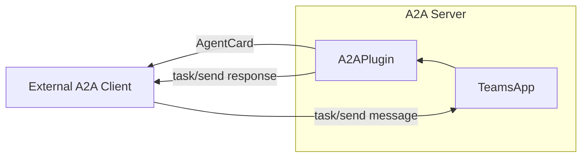

### A2A Client

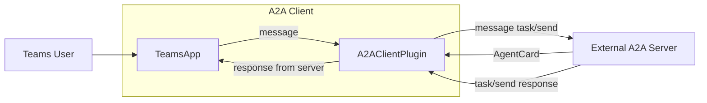

## Protocol Details

For detailed information about the A2A protocol, including agent card structure, message formats, and protocol specifications, see the official [A2A Protocol Documentation](https://a2a-protocol.org/latest/specification/).

---
